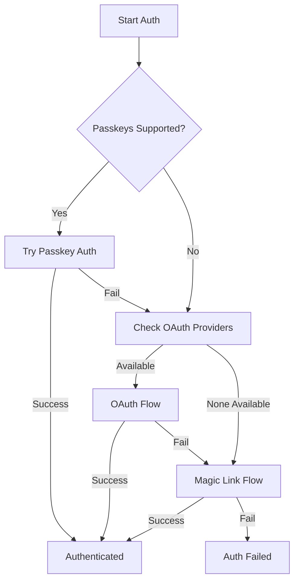

# Authentication System

A comprehensive authentication system with WebAuthn/Passkeys support and multiple fallback options.

## Features

### 🔐 WebAuthn/Passkeys

- Platform authenticator support (Face ID, Touch ID, Windows Hello)
- Secure, passwordless authentication
- Multiple passkey management per user
- Automatic fallback for unsupported devices

### 🔄 OAuth Providers

- Google authentication
- GitHub authentication
- Apple Sign In
- Automatic provider availability detection

### 📧 Magic Link

- Email-based authentication fallback
- Secure token generation
- Configurable expiration times
- Real-time verification status

### 🎯 Smart Fallback Chain

1. Try Passkeys (if supported)
2. Try OAuth providers (in order of availability)
3. Fall back to Magic Link

## Usage

### Basic Authentication

```tsx
import { useAuth, AuthButton } from '@/lib/auth';

function App() {
  const { isAuthenticated, user, login, logout } = useAuth();

  return (
    <div>
      {isAuthenticated ? (
        <div>
          <p>Welcome, {user.name}!</p>
          <button onClick={logout}>Sign Out</button>
        </div>
      ) : (
        <AuthButton onSuccess={() => console.log('Logged in!')} />
      )}
    </div>
  );
}
```

### Passkey Management

```tsx
import { PasskeyManager } from '@/lib/auth';

function Settings() {
  return (
    <div>
      <h2>Security Settings</h2>
      <PasskeyManager />
    </div>
  );
}
```

### Check Passkey Support

```tsx
import { usePasskeySupport } from '@/lib/auth';

function AuthOptions() {
  const { supported, checking } = usePasskeySupport();

  if (checking) return <div>Checking device capabilities...</div>;

  return (
    <div>
      {supported ? (
        <button>Sign in with Passkey</button>
      ) : (
        <button>Sign in with Email</button>
      )}
    </div>
  );
}
```

### OAuth Provider Management

```tsx
import { useOAuthProviders } from '@/lib/auth';

function ConnectedAccounts() {
  const { providers, connectProvider, disconnectProvider } = useOAuthProviders();

  return (
    <div>
      <h3>Connected Accounts</h3>
      {providers.map(({ provider, available, connected }) => (
        <div key={provider}>
          <span>{provider}</span>
          {connected ? (
            <button onClick={() => disconnectProvider(provider)}>
              Disconnect
            </button>
          ) : available ? (
            <button onClick={() => connectProvider(provider)}>
              Connect
            </button>
          ) : (
            <span>Not available</span>
          )}
        </div>
      ))}
    </div>
  );
}
```

### Session Management

```tsx
import { useAuth, useSessionRefresh } from '@/lib/auth';

function SessionManager() {
  const { session } = useAuth();
  const { refreshing, refreshSession } = useSessionRefresh(session);

  return (
    <div>
      <p>Session expires: {session?.expiresAt.toLocaleString()}</p>
      <button onClick={refreshSession} disabled={refreshing}>
        {refreshing ? 'Refreshing...' : 'Refresh Session'}
      </button>
    </div>
  );
}
```

## API

### Hooks

#### `useAuth(apiBaseUrl?: string)`

Main authentication hook providing auth state and methods.

**Returns:**

- `isAuthenticated`: Boolean indicating auth status
- `isLoading`: Loading state
- `user`: Current user object
- `session`: Active session
- `error`: Any authentication errors
- `login()`: Trigger authentication flow
- `logout()`: Sign out user
- `registerPasskey(name)`: Register new passkey
- `checkSession()`: Verify current session
- `on(event, handler)`: Subscribe to auth events

#### `usePasskeySupport()`

Check if the device supports WebAuthn.

**Returns:**

- `supported`: Boolean for passkey support
- `checking`: Loading state

#### `usePasskeys(user)`

Manage user's passkeys.

**Returns:**

- `passkeys`: Array of registered passkeys
- `loading`: Loading state
- `error`: Error message
- `fetchPasskeys()`: Refresh passkey list
- `deletePasskey(id)`: Remove a passkey
- `renamePasskey(id, name)`: Update passkey name

#### `useOAuthProviders()`

Manage OAuth provider connections.

**Returns:**

- `providers`: Array of provider status
- `loading`: Loading state
- `connectProvider(provider)`: Initiate OAuth flow
- `disconnectProvider(provider)`: Remove OAuth connection

#### `useSessionRefresh(session)`

Handle session refresh logic.

**Returns:**

- `refreshing`: Refresh in progress
- `refreshSession()`: Manually refresh session

### Components

#### `<AuthButton />`

Pre-built authentication button with dropdown options.

**Props:**

- `className`: Additional CSS classes
- `onSuccess`: Success callback
- `onError`: Error callback
- `preferredMethod`: Default auth method

#### `<PasskeyManager />`

Complete passkey management interface.

## Architecture

### Authentication Flow



### Security Features

- **Passkey Security**: Uses public key cryptography
- **OAuth State Validation**: CSRF protection with state parameter
- **Magic Link Tokens**: Cryptographically secure, time-limited
- **Session Management**: Automatic refresh before expiry
- **XSS Protection**: All user data sanitized
- **HTTPS Required**: Enforced for production

## Browser Support

### Passkeys

- Chrome 67+ (Windows, macOS, Android)
- Safari 14+ (macOS, iOS)
- Edge 79+
- Firefox 60+ (limited support)

### OAuth

- All modern browsers
- Popup blockers must be disabled

### Magic Links

- All browsers with email access

## Testing

```typescript
import { renderHook, act } from '@testing-library/react-hooks';
import { useAuth } from './hooks';

describe('Authentication', () => {
  it('should handle login flow', async () => {
    const { result } = renderHook(() => useAuth());
    
    expect(result.current.isAuthenticated).toBe(false);
    
    await act(async () => {
      await result.current.login();
    });
    
    expect(result.current.isAuthenticated).toBe(true);
  });
});
```

## Configuration

### Environment Variables

```env
# OAuth Providers
VITE_OAUTH_GOOGLE_CLIENT_ID=xxx
VITE_OAUTH_GITHUB_CLIENT_ID=xxx  
VITE_OAUTH_APPLE_CLIENT_ID=xxx

# API Endpoints
VITE_AUTH_API_URL=/api/auth

# Magic Link Settings
VITE_MAGIC_LINK_EXPIRY=300 # seconds
```

## Accessibility

- Full keyboard navigation
- ARIA labels for screen readers
- Focus management
- High contrast mode support
- Reduced motion respects user preferences

## Performance

- Lazy loading of OAuth SDKs
- Session caching in localStorage
- Automatic cleanup on unmount
- Debounced API calls
- Optimistic UI updates
