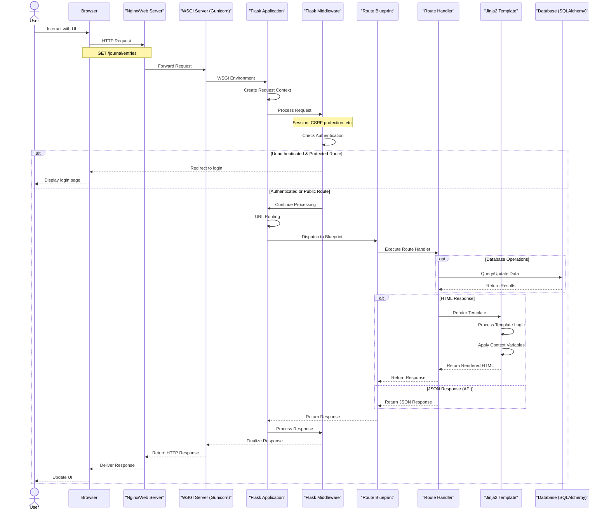

***

title: "Request Lifecycle"
description: "Documentation of the request lifecycle in the Flask Journal application"
category: "Guides"
date\_created: "2025-04-08"
last\_updated: "2025-04-08"
version: "1.0"
status: active
related\_topics:
\- "Architecture Overview"
\- "Authentication"
\- "API Reference"
tags: \["request", "lifecycle", "middleware", "flask", "werkzeug"]
------------------------------------------------------------------

# Request Lifecycle

## Overview

This document illustrates the lifecycle of a typical request in the Flask Journal application, from the moment it reaches the server until the response is sent back to the client. Understanding this flow is essential for debugging, extending functionality, and optimization.

## Request Lifecycle Diagram

The following sequence diagram illustrates the typical journey of a request through the Flask Journal application:

*Figure 1: Sequence diagram illustrating the request lifecycle in the Flask Journal application.*

## Request Lifecycle Stages

### 1. Initial Request

- User interacts with the web interface (clicks a link, submits a form, etc.)
- Browser formulates an HTTP request with appropriate headers, cookies, and payload
- Request is sent to the server hosting the Flask Journal application

### 2. Web Server Processing

- Web server (e.g., Nginx) receives the request
- Performs initial processing (SSL termination, static file handling)
- Forwards dynamic requests to the WSGI server (e.g., Gunicorn)

### 3. WSGI Interface

- WSGI server translates the HTTP request into a WSGI environment
- Flask application is invoked with this environment
- Creates a request context that will be available throughout the request lifecycle

### 4. Flask Application Processing

Each request goes through several layers of processing within the Flask application:

#### 4.1 Middleware Processing

- Flask's built-in and custom middleware process the request
- Session management (using Flask-Login)
- CSRF protection (using Flask-WTF)
- Request preprocessing

#### 4.2 Authentication and Authorization

- Flask-Login checks if the user is authenticated (when required)
- For protected routes, unauthenticated users are redirected to the login page
- For API endpoints, unauthorized requests receive 401/403 responses

#### 4.3 URL Routing

- Flask's URL resolver matches the request path to a registered route
- The request is dispatched to the appropriate blueprint and handler function

#### 4.4 Route Handler Execution

- The route handler function is executed with any URL parameters
- Form data is validated if present
- Business logic is applied

#### 4.5 Database Interaction

- SQLAlchemy ORM is used to query or modify data
- Transactions are managed automatically or explicitly as needed
- Query results are processed for use in the response

#### 4.6 Response Generation

- For HTML responses:
  \- Jinja2 templates are rendered with the provided context
  \- Template inheritance and includes are processed
  \- HTML is generated
- For API responses:
  \- JSON data is serialized
  \- Appropriate content type headers are set

#### 4.7 Response Processing

- Response middleware is applied
- Headers are finalized
- Response is passed back through the WSGI interface

### 5. Response Delivery

- WSGI server formats the response according to HTTP standards
- Web server delivers the response to the client browser
- Browser processes the response (renders HTML, executes JavaScript, etc.)
- UI is updated for the user

## Special Request Flows

### Form Submission

When a form is submitted, additional processing occurs:

1. Form data is parsed and validated using Flask-WTF
2. CSRF token is verified to prevent cross-site request forgery
3. Validation errors trigger re-rendering of the form with error messages
4. On success, a redirect is typically issued to prevent form resubmission

### API Requests

API requests follow a slightly different pattern:

1. Content negotiation determines the response format (usually JSON)
2. Authentication may use different mechanisms (tokens vs. cookies)
3. Responses include appropriate status codes and error details
4. Cross-Origin Resource Sharing (CORS) headers may be applied

### Static Asset Requests

Requests for static assets (CSS, JavaScript, images):

1. Are typically served directly by the web server, bypassing Flask
2. Use cache headers for performance optimization
3. May use content-based hashing for cache busting

## Error Handling

When errors occur during request processing:

1. Exception is caught by Flask's error handlers
2. Appropriate HTTP status code is set (400, 404, 500, etc.)
3. Error page is rendered or error JSON is returned
4. Server errors are logged for troubleshooting

## Performance Considerations

Several factors affect request lifecycle performance:

1. **Database Query Optimization**: Complex or unoptimized queries can significantly slow down request processing
2. **Template Rendering**: Large or complex templates take longer to render
3. **Middleware Overhead**: Each layer of middleware adds processing time
4. **Authentication Checks**: Session validation involves cryptographic operations
5. **Response Size**: Large responses take longer to transmit

## Debugging the Request Lifecycle

To debug issues in the request lifecycle:

1. Enable Flask debug mode for detailed error pages
2. Check application logs for warnings and errors
3. Use Flask's built-in request context locals for introspection
4. Monitor database query performance
5. Inspect network requests in browser developer tools

## See Also

- [Architecture Overview](architecture-overview.md)
- [Authentication Guide](authentication.md)
- [API Reference](api-reference.md)
- [Diagramming Approach](diagramming-approach.md)
