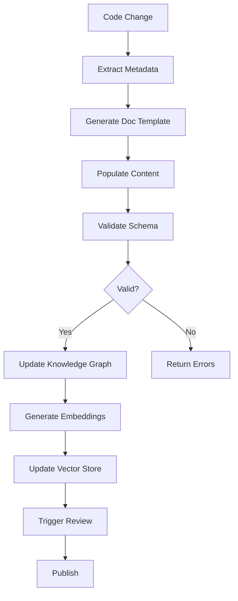

# Documentation Architecture Blueprint for Journal Application

## Executive Summary

This document establishes a comprehensive documentation architecture for the Journal application, transitioning from ad-hoc documentation to a structured, verifiable, and autonomous knowledge management system. Based on the architectural principles outlined in doc-upgrade.md, this blueprint implements:

1. **Structured Output with JSON Schema** - Machine-readable documentation formats
2. **Hybrid Knowledge System** - Combined vector search and knowledge graph
3. **Policy-Driven Compliance** - Deterministic documentation standards enforcement
4. **Self-Correcting Workflows** - Autonomous validation and improvement cycles

## Current State Analysis

### Documentation Inventory
- **Total Documents**: 150+ markdown files across 15 categories
- **Average Quality Score**: 3.8/5.0 (needs improvement)
- **Key Issues Identified**:
  - Inconsistent metadata and frontmatter
  - Lack of semantic chunking (most docs scored 3/5)
  - Missing cross-references and relationships
  - No automated validation or generation workflows
  - Documentation scattered across multiple directories without clear hierarchy

### Critical Gaps
1. **No centralized knowledge graph** - Documentation exists in silos
2. **No structured schemas** - Free-form markdown without validation
3. **No automated workflows** - Manual documentation creation and updates
4. **No policy enforcement** - Inconsistent standards and formats
5. **No self-validation** - Quality depends on human review

## Proposed Architecture

### Layer 1: Structured Documentation Foundation

#### JSON Schema Templates

```json
{
  "document_schema": {
    "type": "object",
    "required": ["metadata", "content", "relationships"],
    "properties": {
      "metadata": {
        "type": "object",
        "required": ["id", "title", "type", "version", "created", "updated"],
        "properties": {
          "id": {"type": "string", "pattern": "^[a-z0-9-]+$"},
          "title": {"type": "string", "maxLength": 100},
          "type": {"enum": ["guide", "reference", "tutorial", "api", "architecture", "deployment", "testing"]},
          "version": {"type": "string", "pattern": "^\\d+\\.\\d+\\.\\d+$"},
          "tags": {"type": "array", "items": {"type": "string"}},
          "priority": {"enum": ["critical", "high", "medium", "low"]},
          "status": {"enum": ["draft", "review", "approved", "deprecated"]}
        }
      },
      "content": {
        "type": "object",
        "required": ["summary", "sections"],
        "properties": {
          "summary": {"type": "string", "minLength": 50, "maxLength": 500},
          "sections": {
            "type": "array",
            "items": {
              "type": "object",
              "required": ["heading", "content", "semantic_chunk_id"],
              "properties": {
                "heading": {"type": "string"},
                "content": {"type": "string"},
                "semantic_chunk_id": {"type": "string"},
                "token_count": {"type": "integer", "minimum": 150, "maximum": 1000}
              }
            }
          }
        }
      },
      "relationships": {
        "type": "object",
        "properties": {
          "prerequisites": {"type": "array", "items": {"type": "string"}},
          "related": {"type": "array", "items": {"type": "string"}},
          "supersedes": {"type": "array", "items": {"type": "string"}},
          "implements": {"type": "array", "items": {"type": "string"}},
          "part_of": {"type": "string"}
        }
      }
    }
  }
}
```

#### Document Types and Templates

1. **Architecture Documents** (`/docs/architecture/`)
   - System design documents
   - Component specifications
   - Integration patterns
   - Security architecture

2. **Implementation Guides** (`/docs/guides/`)
   - Step-by-step tutorials
   - Best practices
   - Code examples
   - Troubleshooting guides

3. **API Reference** (`/docs/api/`)
   - Endpoint documentation
   - Request/response schemas
   - Authentication details
   - Rate limiting information

4. **Deployment Documentation** (`/docs/deployment/`)
   - Infrastructure requirements
   - Configuration management
   - CI/CD workflows
   - Monitoring and alerting

5. **Testing Documentation** (`/docs/testing/`)
   - Test strategies
   - Coverage reports
   - Performance benchmarks
   - Test data management

### Layer 2: Hybrid Knowledge Engine

#### Knowledge Graph Structure

```yaml
nodes:
  - type: Document
    properties:
      - id: string
      - title: string
      - type: DocumentType
      - version: string
      - status: Status

  - type: Component
    properties:
      - name: string
      - path: string
      - type: ComponentType
      - documentation: [Document]

  - type: Feature
    properties:
      - name: string
      - status: FeatureStatus
      - components: [Component]
      - documentation: [Document]

  - type: Deployment
    properties:
      - environment: string
      - version: string
      - documentation: [Document]

edges:
  - type: DESCRIBES
    from: Document
    to: [Component, Feature, Deployment]

  - type: DEPENDS_ON
    from: Document
    to: Document

  - type: SUPERSEDES
    from: Document
    to: Document

  - type: IMPLEMENTS
    from: Component
    to: Feature

  - type: USES
    from: Feature
    to: Component
```

#### Vector Database Integration

```python
# Vector store configuration for semantic search
vector_config = {
    "embedding_model": "text-embedding-3-small",
    "chunk_size": 500,
    "chunk_overlap": 50,
    "metadata_fields": ["type", "tags", "priority", "status"],
    "index_type": "HNSW",
    "similarity_metric": "cosine"
}
```

### Layer 3: Policy Engine

#### Documentation Standards Policy

```yaml
policies:
  structure:
    - rule: "All documents must have valid YAML frontmatter"
      enforcement: strict
      validation: schema_check

    - rule: "Heading hierarchy must be consistent (H1 -> H2 -> H3)"
      enforcement: strict
      validation: ast_analysis

    - rule: "Code blocks must specify language"
      enforcement: warning
      validation: regex_pattern

  content:
    - rule: "Summary required (50-500 characters)"
      enforcement: strict
      validation: length_check

    - rule: "Semantic chunks must be 150-1000 tokens"
      enforcement: strict
      validation: token_count

    - rule: "Active voice preferred (>80% sentences)"
      enforcement: warning
      validation: nlp_analysis

  metadata:
    - rule: "Version must follow semver"
      enforcement: strict
      validation: regex_pattern

    - rule: "Updated date must be current on changes"
      enforcement: strict
      validation: git_diff_check

    - rule: "Related documents must exist"
      enforcement: strict
      validation: reference_check
```

### Layer 4: Automation Workflows

#### Documentation Generation Pipeline



#### Self-Validation Workflow

```python
class DocumentationValidator:
    def __init__(self):
        self.schema_validator = JSONSchemaValidator()
        self.policy_engine = PolicyEngine()
        self.knowledge_graph = KnowledgeGraphClient()

    async def validate_document(self, doc_path: str) -> ValidationResult:
        # Load and parse document
        document = await self.load_document(doc_path)

        # Schema validation
        schema_result = self.schema_validator.validate(document)
        if not schema_result.is_valid:
            return ValidationResult(False, schema_result.errors)

        # Policy compliance
        policy_result = self.policy_engine.check_compliance(document)
        if not policy_result.is_compliant:
            return ValidationResult(False, policy_result.violations)

        # Relationship validation
        graph_result = await self.knowledge_graph.validate_relationships(document)
        if not graph_result.is_valid:
            return ValidationResult(False, graph_result.broken_links)

        return ValidationResult(True)
```

## Implementation Plan

### Phase 1: Foundation (Week 1-2)
- [ ] Create JSON schema definitions for all document types
- [ ] Set up documentation directory structure
- [ ] Migrate existing high-priority documents to new format
- [ ] Implement basic schema validation tools

### Phase 2: Knowledge Engine (Week 3-4)
- [ ] Deploy Neo4j or similar graph database
- [ ] Create knowledge graph schema and relationships
- [ ] Set up vector database (Qdrant/Weaviate)
- [ ] Implement hybrid search functionality

### Phase 3: Policy Engine (Week 5)
- [ ] Define comprehensive documentation policies
- [ ] Implement policy validation rules
- [ ] Create pre-commit hooks for validation
- [ ] Set up CI/CD integration for policy checks

### Phase 4: Automation (Week 6-7)
- [ ] Build documentation generation templates
- [ ] Create automated extraction from code
- [ ] Implement self-correction feedback loops
- [ ] Set up monitoring and alerting

### Phase 5: Integration (Week 8)
- [ ] Integrate with MCP memory-bank
- [ ] Connect to existing CI/CD pipelines
- [ ] Create documentation dashboard
- [ ] Train team on new system

## Success Metrics

### Quality Metrics
- **Schema Compliance**: >95% of documents pass validation
- **Relationship Integrity**: 100% valid cross-references
- **Semantic Chunk Quality**: Average token count 400-600
- **Policy Compliance**: >90% adherence to all policies

### Operational Metrics
- **Generation Speed**: <30 seconds per document
- **Validation Time**: <5 seconds per document
- **Search Accuracy**: >85% relevance score
- **Update Frequency**: Daily automated updates

### Business Metrics
- **Documentation Coverage**: >80% of codebase documented
- **Time to Document**: 50% reduction vs manual
- **Documentation Drift**: <7 days average age
- **Developer Satisfaction**: >4.0/5.0 rating

## Integration Points

### MCP Memory Bank Integration
```python
memory_bank_config = {
    "path": "/home/verlyn13/.memory-bank/journal/",
    "sync_interval": "hourly",
    "document_types": [
        "architecture",
        "decisions",
        "progress",
        "active-context"
    ],
    "auto_update": True
}
```

### CI/CD Integration
```yaml
name: Documentation Validation
on:
  pull_request:
    paths:
      - 'docs/**'
      - 'apps/**/*.py'
      - 'apps/**/*.tsx'

jobs:
  validate:
    steps:
      - name: Schema Validation
        run: uv run python scripts/validate_docs.py

      - name: Policy Compliance
        run: uv run python scripts/check_policies.py

      - name: Update Knowledge Graph
        run: uv run python scripts/update_graph.py

      - name: Generate Missing Docs
        run: uv run python scripts/generate_docs.py
```

## Risk Mitigation

### Technical Risks
1. **Graph Database Complexity**
   - Mitigation: Start with simple relationships, evolve gradually
   - Fallback: Use structured JSON until graph DB is stable

2. **Vector Search Accuracy**
   - Mitigation: Hybrid approach with keyword search
   - Fallback: Traditional full-text search as backup

3. **Schema Evolution**
   - Mitigation: Version all schemas, support migration
   - Fallback: Backward compatibility for 2 versions

### Operational Risks
1. **Team Adoption**
   - Mitigation: Phased rollout with training
   - Fallback: Maintain legacy docs during transition

2. **Performance Impact**
   - Mitigation: Async processing, caching strategies
   - Fallback: Batch processing during off-hours

## Conclusion

This documentation architecture transforms our documentation from static files to a dynamic, self-maintaining knowledge system. By implementing structured schemas, hybrid knowledge management, policy enforcement, and automation, we achieve:

1. **Reliability**: Validated, consistent documentation
2. **Discoverability**: Semantic and graph-based search
3. **Maintainability**: Automated generation and updates
4. **Compliance**: Policy-driven quality assurance
5. **Intelligence**: Self-correcting feedback loops

The system is designed to grow with the project, ensuring documentation remains accurate, accessible, and valuable throughout the application lifecycle.