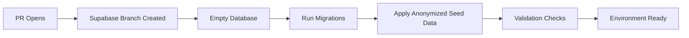

# Data Policy & Preview Environment Security

**Status**: Pre-Production
**Last Updated**: September 16, 2025
**Applies To**: All preview branches, staging, and development environments

## Core Principles

### 🔒 No Production Data in Previews

**RULE**: Preview environments must NEVER contain actual production data, PII, or sensitive information.

**Rationale**:
- Preview branches are ephemeral and less secure
- Multiple developers access preview environments
- Preview databases may be exposed through development tools
- Compliance requirements (GDPR, HIPAA, etc.) mandate data isolation

### 🎭 Anonymization Required

All preview environments must use anonymized data that:
- Preserves data structure and relationships
- Maintains statistical properties for testing
- Removes all personally identifiable information
- Uses realistic but fake data for development

## Implementation Strategy

### Data Categories

| Category | Production | Preview | Local Dev |
|----------|------------|---------|-----------|
| **User PII** | Real data | Anonymized | Fake/Generated |
| **Content** | Real entries | Example content here | Generated |
| **Metadata** | Real timestamps | Shifted dates | Recent dates |
| **Analytics** | Real metrics | Synthetic data | Mock data |
| **Auth Tokens** | Real secrets | Test tokens | Local keys |

### Anonymization Scripts

Located in `scripts/anonymize/`:
- `anonymize.py` - Main anonymization script
- `fake_data.py` - Realistic fake data generators
- `preserve_structure.sql` - Schema preservation queries

## Anonymization Implementation

### User Data Anonymization

```python
# Example transformations applied by scripts/anonymize.py
{
    'email': 'user{id}@journal.local',
    'name': fake.name(),
    'phone': fake.phone_number(),
    'address': fake.address(),
    'ip_address': fake.ipv4(),
    'user_agent': fake.user_agent()
}
```

### Content Anonymization

```python
# Journal entries and user content
{
    'title': fake.sentence(nb_words=4),
    'content': fake.text(max_nb_chars=2000),
    'tags': fake.words(nb=3),
    'metadata': anonymize_json_fields(original_metadata)
}
```

### Temporal Data Preservation

- Preserve relative time relationships
- Shift all dates to recent timeframe (last 90 days)
- Maintain chronological order and intervals
- Keep business day patterns

## Enforcement Mechanisms

### 1. Automated Checks

```bash
# Run before any preview deployment
make db:anonymize:validate
```

Validates:
- No production email domains (@company.com)
- No real phone number patterns
- No credit card or SSN patterns
- No production API keys or tokens

### 2. CI/CD Gates

GitHub Actions automatically:
- Runs anonymization validation on PR preview databases
- Blocks deployment if PII patterns detected
- Generates anonymization report for review

### 3. Manual Review Process

For sensitive data changes:
1. Security team review required
2. Anonymization script updates
3. Validation of new anonymization patterns

## Preview Environment Lifecycle

### 1. Branch Creation


### 2. Data Seeding Process

1. **Schema Setup**: Run Alembic migrations
2. **Data Generation**: Execute anonymization scripts
3. **Validation**: Verify no PII present
4. **Testing**: Run smoke tests against anonymized data

### 3. Environment Cleanup

- Preview branches auto-deleted after PR close
- Data retention: Maximum 7 days post-closure
- Cleanup verification: Ensure complete data removal

## Compliance & Audit

### Audit Trail

All data operations logged:
- Anonymization script executions
- Data access to preview environments
- Export/backup operations
- Environment creation/deletion

### Compliance Alignment

- **GDPR**: No personal data in non-production environments
- **HIPAA**: PHI excluded from preview branches
- **SOC 2**: Data classification and handling procedures
- **ISO 27001**: Information security controls

## Incident Response

### Data Exposure Event

1. **Immediate**: Destroy affected preview environment
2. **Investigation**: Identify data exposure scope
3. **Remediation**: Update anonymization scripts
4. **Prevention**: Enhance detection mechanisms

### Emergency Procedures

```bash
# Emergency preview environment destruction
make db:preview:destroy --branch=<branch-name> --confirm

# Audit log export
make audit:export --start-date=<date> --end-date=<date>
```

## Developer Guidelines

### Before Creating Preview

1. Review data anonymization requirements
2. Update anonymization scripts for new data types
3. Test anonymization locally first
4. Verify no hardcoded production references

### During Development

- Use only anonymized data for testing
- Report any PII exposure immediately
- Test with realistic but fake data volumes
- Validate functionality with anonymized datasets

### Code Review Checklist

- [ ] New data fields included in anonymization scripts
- [ ] No production database references in code
- [ ] Environment-specific configuration used
- [ ] Anonymization validation passes

## Support & Contact

- **Security Team**: security@journal.com
- **Data Protection Officer**: dpo@journal.com
- **Development Lead**: dev-lead@journal.com

## References

- [Supabase Branching Documentation](../supabase.branching.md)
- [Environment Configuration Guide](user-guide/README.md)
- [Security Incident Response Plan](./incident-response.md)

---

**Next Review**: October 16, 2025
**Policy Version**: 1.0
**Approval**: Security Team, Legal Team