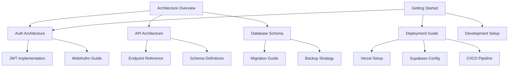

# Documentation System Implementation Roadmap

## Overview

This roadmap outlines the implementation plan for transitioning the Journal application documentation to an autonomous, structured documentation system based on the architectural principles from doc-upgrade.md.

## Pre-Deployment Documentation Goals

### Immediate (Phase 0 - Current Sprint)
✅ **Completed:**
- Created comprehensive documentation architecture blueprint
- Developed JSON schemas for document types (base, API, ADR)
- Built validation script for policy enforcement
- Established documentation roadmap

🚧 **In Progress:**
- Setting up knowledge graph relationships
- Implementing automated workflows

### Critical for Deployment (Phase 1 - Next 2 Weeks)

#### Week 1: Foundation & Structure
- [ ] **Day 1-2: Directory Reorganization**
  - Create new hierarchical directory structure
  - Move existing docs to appropriate categories
  - Update all internal references

- [ ] **Day 3-4: Frontmatter Migration**
  - Add YAML frontmatter to all existing documents
  - Standardize metadata fields
  - Validate against base schema

- [ ] **Day 5: Relationship Mapping**
  - Document all inter-document relationships
  - Create dependency graph
  - Identify orphaned documents

#### Week 2: Automation & Validation
- [ ] **Day 6-7: CI/CD Integration**
  - Add documentation validation to GitHub Actions
  - Create pre-commit hooks for local validation
  - Set up automatic schema checks

- [ ] **Day 8-9: Documentation Generation**
  - Create templates for auto-generation from code
  - Implement API documentation extraction
  - Set up changelog generation

- [ ] **Day 10: Quality Assurance**
  - Run full validation suite
  - Fix all critical errors
  - Update high-priority documents

## Documentation Structure

### New Directory Hierarchy
```
docs/
├── architecture/           # System design and technical architecture
│   ├── overview.md
│   ├── components/
│   ├── integrations/
│   └── security/
├── api/                   # API documentation
│   ├── v1/
│   │   ├── auth/
│   │   ├── entries/
│   │   └── admin/
│   └── schemas/
├── guides/                # How-to guides and tutorials
│   ├── getting-started/
│   ├── development/
│   ├── deployment/
│   └── troubleshooting/
├── reference/             # Technical reference
│   ├── configuration/
│   ├── database/
│   ├── cli/
│   └── errors/
├── decisions/             # Architecture Decision Records
│   ├── adr-001-infisical.md
│   ├── adr-002-auth-strategy.md
│   └── template.md
├── deployment/            # Deployment documentation
│   ├── environments/
│   ├── ci-cd/
│   └── monitoring/
├── testing/              # Testing documentation
│   ├── strategies/
│   ├── coverage/
│   └── data/
├── schemas/              # JSON schemas for validation
│   ├── base-document.schema.json
│   ├── api-reference.schema.json
│   └── architecture-decision.schema.json
└── _generated/           # Auto-generated documentation
    ├── changelog/
    ├── coverage/
    └── metrics/
```

## Key Documents to Create/Update

### Priority 1 (Blocking Deployment)
1. **API Documentation** (`/docs/api/`)
   - Complete endpoint documentation
   - Request/response schemas
   - Authentication guide
   - Error reference

2. **Deployment Guide** (`/docs/deployment/`)
   - Vercel deployment steps
   - Supabase configuration
   - Environment variables
   - Health checks

3. **Security Documentation** (`/docs/architecture/security/`)
   - Authentication architecture
   - JWT token management
   - WebAuthn implementation
   - Security policies

### Priority 2 (Pre-Launch)
1. **Getting Started Guide** (`/docs/guides/getting-started/`)
   - Quick start tutorial
   - Development setup
   - First deployment

2. **Configuration Reference** (`/docs/reference/configuration/`)
   - Environment variables
   - Feature flags
   - Service configurations

3. **Troubleshooting Guide** (`/docs/guides/troubleshooting/`)
   - Common issues
   - Debug procedures
   - Support contacts

## Automation Setup

### GitHub Actions Workflow
```yaml
# .github/workflows/documentation.yml
name: Documentation Pipeline

on:
  push:
    paths:
      - 'docs/**'
      - 'apps/**'
  pull_request:
    paths:
      - 'docs/**'
      - 'apps/**'

jobs:
  validate:
    runs-on: ubuntu-latest
    steps:
      - uses: actions/checkout@v4

      - name: Setup Python
        uses: actions/setup-python@v5
        with:
          python-version: '3.12'

      - name: Install uv
        run: pip install uv

      - name: Install dependencies
        run: uv sync --all-extras --dev

      - name: Validate documentation
        run: uv run python scripts/validate_docs.py

      - name: Check documentation coverage
        run: uv run python scripts/check_doc_coverage.py

      - name: Generate documentation report
        run: uv run python scripts/generate_doc_report.py

      - name: Upload report
        uses: actions/upload-artifact@v4
        with:
          name: documentation-report
          path: docs/_generated/reports/
```

### Pre-commit Hook
```yaml
# .pre-commit-config.yaml
repos:
  - repo: local
    hooks:
      - id: validate-docs
        name: Validate Documentation
        entry: uv run python scripts/validate_docs.py
        language: system
        files: \.md$
        pass_filenames: false
```

## Knowledge Graph Setup

### Initial Graph Structure


## Success Criteria

### Pre-Deployment Checklist
- [ ] All critical documents have valid frontmatter
- [ ] Zero schema validation errors for Priority 1 docs
- [ ] API documentation 100% complete
- [ ] Deployment guide tested and verified
- [ ] Security documentation reviewed
- [ ] Automated validation passing in CI
- [ ] Knowledge graph relationships mapped
- [ ] Documentation coverage >80%

### Quality Metrics Targets
- **Schema Compliance**: 100% for critical docs
- **Relationship Integrity**: All links valid
- **Freshness**: All docs updated within 30 days
- **Completeness**: >90% sections populated
- **Automation**: >50% auto-generated content

## Migration Plan

### Phase 1: Structure (Days 1-3)
1. Create new directory structure
2. Move existing documents
3. Update navigation and indexes

### Phase 2: Metadata (Days 4-5)
1. Add frontmatter to all documents
2. Validate against schemas
3. Fix validation errors

### Phase 3: Relationships (Days 6-7)
1. Map document dependencies
2. Create cross-references
3. Build navigation graph

### Phase 4: Automation (Days 8-10)
1. Set up CI/CD pipelines
2. Create generation scripts
3. Implement validation hooks

### Phase 5: Polish (Days 11-14)
1. Review and update content
2. Fix broken links
3. Optimize for search
4. Final validation

## Post-Deployment Evolution

### Month 1
- Implement vector search
- Set up documentation dashboard
- Create feedback system

### Month 2
- Deploy knowledge graph database
- Implement semantic chunking
- Add AI-assisted generation

### Month 3
- Full automation pipeline
- Self-healing documentation
- Advanced analytics

## Team Training

### Documentation Standards Training
- JSON schema basics
- Frontmatter requirements
- Relationship mapping
- Validation tools

### Tool Training
- Using validation scripts
- CI/CD documentation pipeline
- Auto-generation tools
- Knowledge graph navigation

## Risk Mitigation

### Technical Risks
1. **Migration Complexity**
   - Mitigation: Phased approach with rollback plan
   - Backup: Keep original docs during transition

2. **Team Adoption**
   - Mitigation: Training sessions and documentation
   - Backup: Gradual enforcement of standards

3. **Automation Failures**
   - Mitigation: Manual fallbacks for all automation
   - Backup: Traditional documentation process

## Next Steps

1. **Immediate Actions**
   - Review and approve this roadmap
   - Assign team members to tasks
   - Set up project tracking

2. **This Week**
   - Begin directory reorganization
   - Start frontmatter migration
   - Test validation scripts

3. **Next Week**
   - Complete automation setup
   - Fix validation errors
   - Prepare for deployment

## Conclusion

This roadmap provides a clear path to implementing a robust, autonomous documentation system for the Journal application. By following this plan, we will achieve:

- **Structured, validated documentation**
- **Automated generation and maintenance**
- **Knowledge graph navigation**
- **Policy-driven quality assurance**
- **Deployment-ready documentation**

The system will ensure our documentation remains accurate, accessible, and valuable throughout the application lifecycle, supporting both pre-deployment preparation and long-term maintenance.