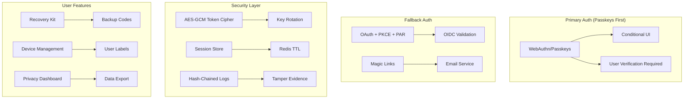
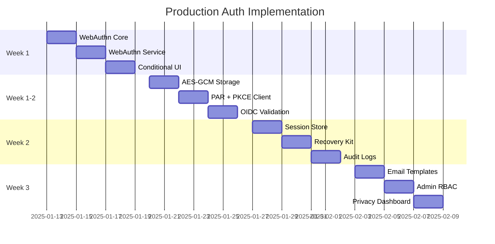

# 🔐 Production User Management Implementation Plan

## Architecture Overview



## 📋 Implementation Phases

### Phase 1: WebAuthn/Passkeys Foundation (Week 1) ✅ COMPLETED (PR #25)

#### Day 1-2: Core Infrastructure

```python
# apps/api/app/infra/sa_models.py
from sqlalchemy import String, LargeBinary, Integer, ForeignKey
from sqlalchemy.dialects.postgresql import UUID
from sqlalchemy.orm import Mapped, mapped_column, relationship
from uuid import uuid4
from datetime import datetime

class WebAuthnCredential(Base):
    __tablename__ = "webauthn_credentials"

    id: Mapped[UUID] = mapped_column(primary_key=True, default_factory=uuid4)
    user_id: Mapped[UUID] = mapped_column(ForeignKey("users.id", ondelete="CASCADE"), index=True)
    credential_id: Mapped[bytes] = mapped_column(LargeBinary, unique=True)  # rawId
    public_key: Mapped[bytes] = mapped_column(LargeBinary)  # COSE key
    sign_count: Mapped[int] = mapped_column(Integer, default=0)
    transports: Mapped[str | None] = mapped_column(String(120), nullable=True)  # CSV
    aaguid: Mapped[str | None] = mapped_column(String(64), nullable=True)
    nickname: Mapped[str | None] = mapped_column(String(100), nullable=True)  # User-friendly name
    created_at: Mapped[datetime] = mapped_column(server_default=func.now())
    last_used_at: Mapped[datetime | None] = mapped_column(nullable=True)

    # Relationships
    user: Mapped["User"] = relationship(back_populates="webauthn_credentials")
```

#### Day 3-4: WebAuthn Service with Conditional UI

```python
# apps/api/app/domain/auth/webauthn_service.py
from webauthn import (
    generate_registration_options,
    verify_registration_response,
    generate_authentication_options,
    verify_authentication_response,
)
from webauthn.helpers.structs import (
    PublicKeyCredentialRpEntity,
    PublicKeyCredentialUserEntity,
    AuthenticatorSelectionCriteria,
    ResidentKeyRequirement,
    UserVerificationRequirement,
)

@dataclass
class RPSettings:
    rp_id: str           # EXACT domain, no protocol
    rp_name: str         # Display name
    origin: str          # Full URL with protocol

class WebAuthnService:
    def __init__(self, rp: RPSettings, session_factory: async_sessionmaker, redis: Redis):
        self.rp = rp
        self.session_factory = session_factory
        self.challenge_store = WebAuthnChallengeStore(redis)

    async def registration_options(self, user_id: UUID, username: str, display_name: str) -> dict:
        """Generate registration options with passkey-first settings."""
        selection = AuthenticatorSelectionCriteria(
            resident_key=ResidentKeyRequirement.REQUIRED,  # Passkeys
            user_verification=UserVerificationRequirement.REQUIRED,  # Biometric/PIN
            authenticator_attachment=None,  # Allow both platform and cross-platform
        )

        # Exclude existing credentials
        existing = await self.get_user_credentials(user_id)
        exclude = [cred.credential_id for cred in existing]

        opts = generate_registration_options(
            rp=PublicKeyCredentialRpEntity(id=self.rp.rp_id, name=self.rp.rp_name),
            user=PublicKeyCredentialUserEntity(
                id=user_id.bytes,
                name=username,
                display_name=display_name,
            ),
            authenticator_selection=selection,
            attestation="none",  # Lower friction, no PII
            exclude_credentials=exclude,
        )

        # Store challenge with TTL
        await self.challenge_store.put(
            session_id=str(user_id),
            challenge=opts.challenge,
            kind="registration",
            ttl_seconds=300
        )

        return options_to_json(opts)
```

#### Day 5-6: Frontend Conditional UI

```typescript
// apps/web/src/lib/webauthn/passkey-manager.ts
export class PasskeyManager {
  private abortController?: AbortController;

  async setupConditionalUI(): Promise<void> {
    // Check browser support
    if (!this.supportsConditionalUI()) {
      return;
    }

    // Abort any existing conditional UI
    this.abortController?.abort();
    this.abortController = new AbortController();

    try {
      // Get authentication options from server
      const options = await this.getAuthenticationOptions();

      // Add conditional mediation
      const credential = await navigator.credentials.get({
        publicKey: options,
        mediation: 'conditional',
        signal: this.abortController.signal
      });

      if (credential) {
        await this.completeAuthentication(credential);
      }
    } catch (error) {
      if (error.name !== 'AbortError') {
        console.error('Conditional UI error:', error);
      }
    }
  }

  private supportsConditionalUI(): boolean {
    return typeof PublicKeyCredential !== 'undefined' &&
           'isConditionalMediationAvailable' in PublicKeyCredential;
  }

  async promptPasskeyAfterLogin(): Promise<void> {
    // Show modal after OAuth/magic link login
    const shouldAdd = await this.showPasskeyPrompt();
    if (shouldAdd) {
      await this.registerPasskey();
    }
  }
}
```

### Phase 2: OAuth with Modern Security (Week 1) ✅ COMPLETED (PR #27)

#### Day 1-2: AES-GCM Token Storage

```python
# apps/api/app/security/token_cipher.py
from cryptography.hazmat.primitives.ciphers.aead import AESGCM
import base64
import json
import os
from typing import Dict

class TokenCipher:
    """AES-GCM cipher with key rotation support."""

    def __init__(self, keys: Dict[str, bytes], active_kid: str):
        if active_kid not in keys:
            raise KeyConfigError(f"Active key '{active_kid}' not in keys")
        self._keys = keys
        self._active_kid = active_kid

    @classmethod
    def from_env(cls) -> "TokenCipher":
        """Load from AUTH_ENC_KEYS and AUTH_ENC_ACTIVE_KID env vars."""
        raw_map = os.environ["AUTH_ENC_KEYS"]
        active = os.environ["AUTH_ENC_ACTIVE_KID"]
        parsed = json.loads(raw_map)

        keys = {}
        for kid, b64_key in parsed.items():
            key = base64.urlsafe_b64decode(b64_key + '=' * (-len(b64_key) % 4))
            if len(key) not in (16, 24, 32):
                raise KeyConfigError(f"Key '{kid}' must be 128/192/256-bit")
            keys[kid] = key

        return cls(keys=keys, active_kid=active)

    def encrypt(self, plaintext: str, aad: bytes | None = None) -> str:
        """Encrypt with active key, return JSON envelope."""
        key = self._keys[self._active_kid]
        aesgcm = AESGCM(key)
        iv = os.urandom(12)
        ciphertext = aesgcm.encrypt(iv, plaintext.encode(), aad)

        envelope = {
            "v": 1,
            "kid": self._active_kid,
            "iv": base64.urlsafe_b64encode(iv).decode().rstrip('='),
            "ct": base64.urlsafe_b64encode(ciphertext).decode().rstrip('=')
        }
        return json.dumps(envelope, separators=(',', ':'))

    def decrypt(self, envelope: str, aad: bytes | None = None) -> str:
        """Decrypt envelope, supports old keys for rotation."""
        obj = json.loads(envelope)
        if obj.get("v") != 1:
            raise ValueError("Unsupported ciphertext version")

        kid = obj["kid"]
        key = self._keys.get(kid)
        if not key:
            raise KeyError(f"Key '{kid}' unavailable")

        aesgcm = AESGCM(key)
        iv = base64.urlsafe_b64decode(obj["iv"] + '=' * (-len(obj["iv"]) % 4))
        ct = base64.urlsafe_b64decode(obj["ct"] + '=' * (-len(obj["ct"]) % 4))

        plaintext = aesgcm.decrypt(iv, ct, aad)
        return plaintext.decode()
```

#### Day 3-4: PAR Client with PKCE

```python
# apps/api/app/domain/auth/par_client.py
import secrets
import hashlib
import base64
import httpx
from typing import Dict, Tuple, Optional

class PARClient:
    """OAuth 2.1 client with PAR (Pushed Authorization Requests) support."""

    def __init__(
        self,
        metadata: Dict,
        client_id: str,
        client_secret: Optional[str],
        redirect_uri: str
    ):
        self.meta = metadata
        self.client_id = client_id
        self.client_secret = client_secret
        self.redirect_uri = redirect_uri

    def supports_par(self) -> bool:
        """Check if provider supports PAR."""
        return bool(self.meta.get("pushed_authorization_request_endpoint"))

    async def build_authorize_url(
        self,
        scope: str,
        state: str,
        nonce: Optional[str] = None,
        extra_params: Optional[Dict[str, str]] = None,
    ) -> Tuple[str, Dict[str, str], str]:
        """
        Build authorization URL with PKCE.
        Uses PAR if supported, falls back to regular auth request.
        """
        # Generate PKCE challenge
        verifier = base64.urlsafe_b64encode(secrets.token_bytes(32)).decode().rstrip('=')
        challenge = base64.urlsafe_b64encode(
            hashlib.sha256(verifier.encode()).digest()
        ).decode().rstrip('=')

        params = {
            "response_type": "code",
            "client_id": self.client_id,
            "redirect_uri": self.redirect_uri,
            "scope": scope,
            "state": state,
            "code_challenge": challenge,
            "code_challenge_method": "S256",
        }

        if nonce:
            params["nonce"] = nonce
        if extra_params:
            params.update(extra_params)

        if not self.supports_par():
            # Regular authorization request
            return self.meta["authorization_endpoint"], params, verifier

        # Use PAR
        par_endpoint = self.meta["pushed_authorization_request_endpoint"]
        async with httpx.AsyncClient(timeout=10.0) as client:
            auth = (self.client_id, self.client_secret) if self.client_secret else None
            resp = await client.post(
                par_endpoint,
                data=params,
                auth=auth,
                headers={"Content-Type": "application/x-www-form-urlencoded"}
            )
            resp.raise_for_status()
            par_response = resp.json()

        # PAR returns request_uri to use at authorization endpoint
        return self.meta["authorization_endpoint"], {
            "client_id": self.client_id,
            "request_uri": par_response["request_uri"]
        }, verifier
```

#### Day 5-6: OIDC Validation

```python
# apps/api/app/security/oidc.py
from jose import jwt
import httpx
from typing import Dict, Optional

async def validate_id_token(
    id_token: str,
    issuer: str,
    audience: str,
    nonce_expected: Optional[str],
    jwks_uri: str,
    leeway: int = 60,
) -> Dict:
    """Validate OIDC ID token with proper checks."""

    # Fetch JWKS
    async with httpx.AsyncClient(timeout=10.0) as client:
        jwks = (await client.get(jwks_uri)).json()

    # Get key ID from token header
    headers = jwt.get_unverified_header(id_token)
    kid = headers.get("kid")

    # Find matching key
    key = next((k for k in jwks["keys"] if k.get("kid") == kid), None)
    if not key:
        raise ValueError("No matching JWKS key")

    # Verify token
    claims = jwt.decode(
        id_token,
        key,
        algorithms=[headers.get("alg")],
        audience=audience,
        issuer=issuer,
        options={
            "verify_aud": True,
            "verify_signature": True,
            "verify_exp": True,
            "leeway": leeway,
        }
    )

    # Verify nonce if expected
    if nonce_expected and claims.get("nonce") != nonce_expected:
        raise ValueError("Nonce mismatch")

    # Verify required claims
    if not claims.get("sub"):
        raise ValueError("Missing subject claim")

    return claims
```

### Phase 3: Session & Device Management (Week 2) ✅ COMPLETED (PR #28)

#### Day 1-2: Session Store (No Fingerprinting)

```python
# apps/api/app/infra/sa_models.py
class UserDevice(Base):
    __tablename__ = "user_devices"

    id: Mapped[UUID] = mapped_column(primary_key=True, default_factory=uuid4)
    user_id: Mapped[UUID] = mapped_column(ForeignKey("users.id", ondelete="CASCADE"))

    # User-provided label, not fingerprint
    device_name: Mapped[str] = mapped_column(String(100))

    # Metadata for display only
    browser: Mapped[str | None] = mapped_column(String(100), nullable=True)
    os: Mapped[str | None] = mapped_column(String(100), nullable=True)

    # Coarse location only (city/region, not precise)
    location_region: Mapped[str | None] = mapped_column(String(100), nullable=True)

    # Trust and tracking
    trusted: Mapped[bool] = mapped_column(default=False)
    last_seen_at: Mapped[datetime] = mapped_column(server_default=func.now())
    created_at: Mapped[datetime] = mapped_column(server_default=func.now())

    # Relationships
    user: Mapped["User"] = relationship(back_populates="devices")
    sessions: Mapped[list["UserSession"]] = relationship(back_populates="device")
```

#### Day 3-4: Recovery Kit

```python
# apps/api/app/domain/auth/recovery_service.py
import secrets
from typing import List

class RecoveryService:
    def generate_recovery_kit(self, user_id: UUID) -> dict:
        """Generate recovery codes and backup info."""
        codes = self.generate_recovery_codes(10)

        # Store hashed codes
        for code in codes:
            hashed = self.hash_recovery_code(code, user_id)
            # Store in DB

        return {
            "codes": codes,
            "generated_at": datetime.utcnow(),
            "instructions": self.get_recovery_instructions()
        }

    def generate_recovery_codes(self, count: int = 10) -> List[str]:
        """Generate high-entropy recovery codes."""
        codes = []
        for _ in range(count):
            # 8 chars, formatted as XXXX-XXXX
            code = secrets.token_urlsafe(6).upper()[:8]
            codes.append(f"{code[:4]}-{code[4:8]}")
        return codes

    def hash_recovery_code(self, code: str, user_id: UUID) -> str:
        """Hash with user-specific salt."""
        salt = hashlib.sha256(user_id.bytes).digest()
        return hashlib.pbkdf2_hmac('sha256', code.encode(), salt, 100_000).hex()
```

### Phase 4: Privacy Dashboard (Week 2) ✅ COMPLETED (PR #29)

#### Day 5-6: Hash-Chained Audit Log

```python
# apps/api/app/infra/sa_models.py
class AuditLogEntry(Base):
    __tablename__ = "audit_log"

    id: Mapped[UUID] = mapped_column(primary_key=True, default_factory=uuid4)
    user_id: Mapped[UUID] = mapped_column(ForeignKey("users.id"), index=True)

    # Event details
    event_type: Mapped[str] = mapped_column(String(50))
    event_data: Mapped[dict] = mapped_column(JSON)
    ip_address: Mapped[str] = mapped_column(String(45))
    user_agent: Mapped[str | None] = mapped_column(String(255), nullable=True)

    # Hash chain for tamper evidence
    prev_hash: Mapped[str] = mapped_column(String(64))
    entry_hash: Mapped[str] = mapped_column(String(64), unique=True)

    created_at: Mapped[datetime] = mapped_column(server_default=func.now())

    @classmethod
    async def append(cls, session: AsyncSession, user_id: UUID, event: str, data: dict) -> "AuditLogEntry":
        """Append with hash chain."""
        # Get previous entry's hash
        prev = await session.scalar(
            select(cls.entry_hash)
            .where(cls.user_id == user_id)
            .order_by(cls.created_at.desc())
            .limit(1)
        )
        prev_hash = prev or "0" * 64

        # Create entry
        entry = cls(
            user_id=user_id,
            event_type=event,
            event_data=data,
            prev_hash=prev_hash,
            # ... other fields
        )

        # Compute entry hash
        content = f"{user_id}{event}{json.dumps(data)}{prev_hash}{entry.created_at}"
        entry.entry_hash = hashlib.sha256(content.encode()).hexdigest()

        session.add(entry)
        return entry
```

### Phase 5: Advanced Threat Mitigation (Week 3)

#### Day 1-2: OAuth Token Rotation Detection

```python
# apps/api/app/domain/auth/token_rotation_service.py
from typing import Optional
from uuid import UUID
import hashlib
from redis import Redis

class TokenRotationService:
    """Detect and prevent refresh token reuse attacks (RFC 9700)."""
    
    def __init__(self, redis: Redis):
        self.redis = redis
        
    async def check_refresh_token_reuse(
        self, 
        token_hash: str, 
        user_id: UUID
    ) -> bool:
        """Detect if a refresh token has been reused."""
        used_key = f"used_refresh:{token_hash}"
        
        if await self.redis.exists(used_key):
            # SECURITY ALERT: Token reuse detected
            await self.revoke_all_user_tokens(user_id)
            await self.log_security_incident(user_id, "refresh_token_reuse")
            return True
            
        # Mark token as used (24hr TTL)
        await self.redis.setex(used_key, 86400, "1")
        return False
        
    async def revoke_all_user_tokens(self, user_id: UUID):
        """Revoke all tokens for a user after security incident."""
        # Revoke all sessions
        from sqlalchemy import update
        await self.session.execute(
            update(UserSession)
            .where(UserSession.user_id == user_id)
            .values(revoked_at=datetime.now(UTC))
        )
        
        # Clear OAuth tokens from encrypted storage
        await self.redis.delete(f"oauth_tokens:{user_id}")
```

#### Day 3-4: WebAuthn Step-Up Authentication

```python
# apps/api/app/domain/auth/stepup_service.py
from datetime import datetime, timedelta
from typing import Literal

SensitiveAction = Literal[
    "delete_account", 
    "export_data", 
    "change_email",
    "disable_2fa",
    "view_recovery_codes"
]

class StepUpAuthService:
    """Require fresh WebAuthn authentication for sensitive actions."""
    
    FRESH_AUTH_WINDOW = timedelta(minutes=5)
    
    async def require_fresh_auth(
        self,
        user_id: UUID,
        action: SensitiveAction,
        session: AsyncSession
    ) -> dict:
        """Generate fresh WebAuthn challenge for step-up."""
        # Check if user has recent WebAuthn auth
        recent_auth = await session.scalar(
            select(AuditLogEntry)
            .where(
                AuditLogEntry.user_id == user_id,
                AuditLogEntry.event_type == "webauthn_verify",
                AuditLogEntry.created_at > datetime.now(UTC) - self.FRESH_AUTH_WINDOW
            )
            .order_by(AuditLogEntry.created_at.desc())
        )
        
        if recent_auth and recent_auth.event_data.get("action") == action:
            return {"required": False, "recent_auth": recent_auth.created_at}
            
        # Generate fresh challenge
        challenge = secrets.token_bytes(32)
        await self.redis.setex(
            f"stepup:{user_id}:{action}",
            300,  # 5 minute TTL
            base64.b64encode(challenge).decode()
        )
        
        return {
            "required": True,
            "challenge": base64.b64encode(challenge).decode(),
            "action": action
        }
```

#### Day 5-6: Rate Limiting & Brute Force Protection

```python
# apps/api/app/domain/auth/rate_limiter.py
from typing import Optional
import hashlib

class AuthRateLimiter:
    """Advanced rate limiting for authentication endpoints."""
    
    LIMITS = {
        "login": {"attempts": 5, "window": 300},  # 5 attempts per 5 min
        "totp": {"attempts": 5, "window": 300},
        "recovery_code": {"attempts": 3, "window": 600},  # 3 per 10 min
        "password_reset": {"attempts": 3, "window": 3600},  # 3 per hour
    }
    
    async def check_rate_limit(
        self,
        action: str,
        identifier: str,  # user_id or IP
        redis: Redis
    ) -> tuple[bool, Optional[int]]:
        """Check if action is rate limited."""
        limit_config = self.LIMITS.get(action)
        if not limit_config:
            return True, None
            
        key = f"ratelimit:{action}:{hashlib.sha256(identifier.encode()).hexdigest()}"
        current = await redis.incr(key)
        
        if current == 1:
            await redis.expire(key, limit_config["window"])
            
        if current > limit_config["attempts"]:
            ttl = await redis.ttl(key)
            return False, ttl
            
        return True, None
        
    async def record_failed_attempt(
        self,
        action: str,
        user_id: Optional[UUID],
        ip_address: str,
        redis: Redis,
        session: AsyncSession
    ):
        """Record failed auth attempt for analysis."""
        # Track by both user and IP
        if user_id:
            await self.check_rate_limit(action, str(user_id), redis)
        await self.check_rate_limit(action, ip_address, redis)
        
        # Log to audit trail
        if user_id:
            await AuditService(session).log_event(
                user_id=user_id,
                event_type=f"{action}_failed",
                event_data={"ip": ip_address},
                ip_address=ip_address
            )
```

## 🚀 Implementation Schedule



## ✅ Definition of Done Checklist

### Per Feature
- [ ] Database migrations tested up/down
- [ ] Redis TTL boundaries verified
- [ ] Challenge replay attacks prevented
- [ ] Session rotation on privilege escalation
- [ ] Audit log entries created
- [ ] Error messages don't leak info
- [ ] Rate limiting applied
- [ ] Metrics/monitoring exposed
- [ ] Integration tests pass
- [ ] Documentation updated

### Security Review
- [ ] No plain text secrets
- [ ] All tokens encrypted with AES-GCM
- [ ] PKCE on all OAuth flows
- [ ] Nonce validation on OIDC
- [ ] WebAuthn UV required
- [ ] No browser fingerprinting
- [ ] Cookies: Secure, HttpOnly, SameSite
- [ ] Hash-chained audit integrity

## 📦 Dependencies

```toml
[project.dependencies]
# Crypto
cryptography = "^45.0.7"

# WebAuthn
webauthn = "^2.7.0"

# OAuth/OIDC
authlib = "^1.6.3"
python-jose = "^3.5.0"
httpx = "^0.28.1"

# Email
mjml = "^0.7.0"
jinja2 = "^3.1.6"

# Storage
redis = "^8.2.1"

# 2FA (if needed beyond WebAuthn)
pyotp = "^2.9.0"
qrcode = "^7.4.2"
```

## 🎯 Next Immediate Step

**Create branch: `feat/webauthn-passkeys-foundation`**

Start with WebAuthn as the primary auth method, following the security-first pattern. This gives users the best experience (biometric login) while maintaining highest security.

Looking at the security advice document compared to the implementation plan, here are the critical details that need more emphasis or were omitted:

## 🔴 Critical Missing Security Details

### 1. Password Handling (If Kept as Legacy)
The security advice strongly recommends:
- **Hide passwords behind "Advanced" option** - not primary UI
- **Argon2id specific params**: ≥19 MiB memory, iterations ≥2, parallelism 1
- **NO composition rules** - use zxcvbn strength meter instead
- This wasn't included in your plan at all

### 2. TOTP Implementation Specifics
```python
# Missing from your plan - RFC 6238 compliance
class TOTPService:
    def verify_token(self, secret: str, token: str) -> bool:
        totp = pyotp.TOTP(secret)
        # CRITICAL: ±1 step window for clock skew, not more
        return totp.verify(token, valid_window=1)

    # MUST have rate limiting
    @rate_limit(max_attempts=5, window_seconds=300)
    def verify_with_rate_limit(self, ...):
        # Prevent brute force
```

### 3. Email Infrastructure Requirements
Not covered in your plan:
- **SPF/DKIM/DMARC alignment** mandatory for sender domain
- **UTM parameters** for tracking (per template)
- **Unsubscribe footer** required for non-transactional mail
- **Pre-compile MJML in CI** - not just runtime

### 4. Session Architecture Principle
The advice emphasizes a critical pattern:
> "Short-lived access tokens + httpOnly session cookies for your first-party web—treat your own session as primary, OAuth tokens as secondary/portable"

This means OAuth tokens should be exchanged for YOUR session, not used directly.

### 5. Testing Requirements Matrix

| Test Case | Required Coverage | Your Plan |
|-----------|------------------|-----------|
| PKCE verifier mismatch | Must reject | ❌ Missing |
| PAR path verification | Where supported | ❌ Missing |
| Conditional UI browsers | Safari/Chrome/Firefox + iOS/Android | ❌ Missing |
| Privilege step-up | Triggers WebAuthn re-auth | ❌ Missing |
| Single-use backup codes | Must track usage | ⚠️ Partial |

### 6. Privacy Dashboard Specifics
```python
# Missing implementation details
class PrivacyDashboard:
    async def schedule_deletion(self, user_id: UUID) -> dict:
        """30-day deletion with undo window"""
        return {
            "scheduled_for": datetime.now() + timedelta(days=30),
            "undo_token": secrets.token_urlsafe(32),
            "undo_expires": datetime.now() + timedelta(days=7)
        }

    async def export_user_data(self, user_id: UUID) -> dict:
        """Export content + metadata"""
        return {
            "content": await self.get_user_content(user_id),
            "metadata": await self.get_user_metadata(user_id),
            "audit_log": await self.get_audit_log(user_id),
            "format": "json"  # Also support CSV
        }
```

### 7. WebAuthn Step-Up for Sensitive Actions
```python
# Critical for privilege escalation
async def require_webauthn_stepup(
    request: Request,
    action: str  # "delete_account", "export_data", etc.
) -> bool:
    """Force fresh WebAuthn auth for sensitive actions"""
    fresh_challenge = generate_challenge()
    # Even if user is logged in, require fresh biometric
    return await verify_fresh_authentication(fresh_challenge)
```

### 8. Critical SQLAlchemy Pattern
The advice warns:
> "keep the lifespan pattern you wrote and use SQLAlchemy 2.0 select()/scalars() throughout (no Session.query)"

Ensure NO legacy patterns:
```python
# ❌ NEVER use this
results = session.query(User).filter_by(email=email).first()

# ✅ Always use this
result = await session.scalar(
    select(User).where(User.email == email)
)
```

### 9. OAuth Token Rotation Detection
```python
# Missing security feature
class OAuthTokenStore:
    async def detect_refresh_reuse(self, token_hash: str) -> bool:
        """RFC 9700: detect refresh token reuse attack"""
        if await self.redis.exists(f"used_refresh:{token_hash}"):
            # SECURITY: Token reuse detected, revoke all tokens
            await self.revoke_all_tokens_for_user(user_id)
            await self.alert_security_team(...)
            return True
        await self.redis.setex(f"used_refresh:{token_hash}", 86400, "1")
        return False
```

### 10. Audit Log Critical Features
The hash-chain must be **append-only** and include:
```python
# Missing tamper detection
async def verify_audit_integrity(user_id: UUID) -> bool:
    """Verify hash chain hasn't been tampered with"""
    entries = await get_user_audit_log(user_id)
    prev_hash = "0" * 64
    for entry in entries:
        expected = hashlib.sha256(
            f"{entry.user_id}{entry.event_type}{entry.event_data}"
            f"{prev_hash}{entry.created_at}".encode()
        ).hexdigest()
        if entry.entry_hash != expected:
            return False  # Tampering detected!
        prev_hash = entry.entry_hash
    return True
```

## 📊 Metrics You're Missing

The advice specifies Day 1 metrics not in your plan:
- Passkey registration success rate by browser
- OAuth PKCE failure rate
- TOTP attempts before success
- Session rotation frequency
- Audit log verification time

## 🚨 Immediate Actions

1. **Add password parameters** if keeping legacy auth
2. **Implement TOTP rate limiting** with Redis
3. **Add WebAuthn step-up** for sensitive actions
4. **Create test matrix** for browser compatibility
5. **Add refresh token reuse detection**
6. **Implement deletion scheduling** with undo
7. **Add SPF/DKIM verification** to email setup

The security document emphasizes these aren't optional - they're required for production security.
