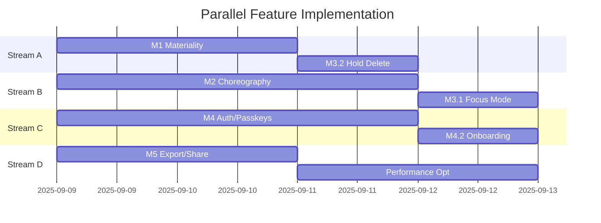

# Journal App UI/UX Orchestration Plan v2.0
## Parallel Refactor Strategy for Claude Code CLI Agent

```yaml
orchestration_version: 2.0.0
execution_date: 2025-09-06
agent: claude-opus-4-1
mode: interactive_orchestrated
parallelization_factor: 4
risk_tolerance: low
rollback_enabled: true
```

---

## Phase 0: Discovery & Infrastructure Setup
**Duration: 2-3 days | Parallelizable: Yes**

### 0.1 Codebase Analysis & Audit
```bash
# Branch: feat/discovery-audit
git checkout -b feat/discovery-audit
```

**Tasks (Parallel Execution):**

```yaml
stream_A:
  - task: analyze_current_architecture
    actions:
      - Map component hierarchy
      - Document all dependencies (package.json/lock analysis)
      - Identify tech stack (Next.js/Vite/React version)
      - Backend API surface analysis
      - Database schema documentation
    output: /docs/current-architecture.md

stream_B:
  - task: performance_baseline
    actions:
      - Lighthouse CI setup and baseline
      - Bundle size analysis (webpack-bundle-analyzer)
      - Runtime performance profiling
      - Memory leak detection
      - Current accessibility audit (axe-core)
    output: /metrics/baseline-report.json

stream_C:
  - task: test_coverage_analysis
    actions:
      - Unit test coverage report
      - Integration test inventory
      - E2E test suite review
      - Missing test identification
      - Test infrastructure health check
    output: /testing/coverage-baseline.html

stream_D:
  - task: dependency_audit
    actions:
      - Security vulnerabilities (npm audit)
      - Outdated packages analysis
      - Peer dependency conflicts
      - Bundle tree-shaking opportunities
      - License compliance check
    output: /audit/dependency-report.md
```

### 0.2 Infrastructure Preparation
```bash
# Branch: feat/infra-setup
git checkout -b feat/infra-setup
```

**Sequential Setup (Must Complete Before Phase 1):**

```typescript
// .claude-orchestration/config.ts
export const orchestrationConfig = {
  ci: {
    provider: 'github-actions', // or gitlab-ci, circleci
    parallelJobs: 4,
    matrixStrategy: ['node-18', 'node-20'],
    cacheStrategy: 'aggressive'
  },

  qualityGates: {
    coverage: { min: 80, delta: -2 },
    bundleSize: { max: '500kb', deltaPercent: 5 },
    lighthouse: {
      performance: 90,
      accessibility: 95,
      bestPractices: 100,
      seo: 90
    },
    typecheck: 'strict',
    linting: 'error-free'
  },

  branchStrategy: {
    protection: {
      main: ['require-pr', 'require-review', 'ci-pass'],
      develop: ['require-pr', 'ci-pass']
    },
    naming: {
      feature: 'feat/{ticket}-{description}',
      fix: 'fix/{ticket}-{description}',
      refactor: 'refactor/{area}-{description}'
    }
  }
}
```

**Setup Tasks:**

1. **Automated Testing Pipeline**
```yaml
- Configure Playwright for E2E
- Setup React Testing Library
- Configure visual regression (Percy/Chromatic)
- Setup performance regression tests
- Configure accessibility testing (Pa11y)
```

2. **Code Quality Tools**
```yaml
- ESLint config (with custom rules for motion tokens)
- Prettier with consistent formatting
- Husky + lint-staged for pre-commit
- Commitlint for conventional commits
- TypeScript strict mode migration plan
```

3. **Feature Flag System**
```typescript
// feature-flags.config.ts
export const featureFlags = {
  'ui.materiality': { default: false, rollout: 0 },
  'ui.motion': { default: false, rollout: 0 },
  'ui.ceremony': { default: false, rollout: 0 },
  'auth.passkeys': { default: false, rollout: 0 },
  'export.sheet': { default: false, rollout: 0 }
}
```

---

## Phase 1: Foundation Layer
**Duration: 3-4 days | Parallelizable: Yes**

### Branch Strategy
```bash
# Create develop branch from main
git checkout main
git pull origin main
git checkout -b develop

# Create parallel feature branches
git checkout -b refactor/design-tokens
git checkout -b refactor/motion-system
git checkout -b refactor/component-architecture
git checkout -b refactor/accessibility-base
```

### 1.1 Design Token System
**Branch:** `refactor/design-tokens`

```typescript
// packages/design-tokens/src/index.ts
export const tokens = {
  color: {
    dawn: { /* ... */ },
    dusk: { /* ... */ }
  },
  spacing: { /* scale */ },
  elevation: { /* shadows */ },
  motion: {
    panel: 'cubic-bezier(0.2, 0.8, 0.2, 1)',
    emphasis: 'cubic-bezier(0.4, 0, 0.2, 1)',
    standard: '200ms ease'
  },
  breakpoints: {
    mobile: 0,
    tablet: 768,
    desktop: 1280,
    wide: 1920
  }
}
```

**Tasks:**
```yaml
parallel_tasks:
  - task: create_token_package
    test: unit tests for token generation
    validation: CSS custom properties output

  - task: build_token_documentation
    tool: Storybook or Docusaurus
    output: interactive token explorer

  - task: migrate_hardcoded_values
    script: codemod for value replacement
    validation: visual regression tests
```

### 1.2 Motion System Architecture
**Branch:** `refactor/motion-system`

```typescript
// lib/motion/orchestrator.ts
export class MotionOrchestrator {
  private readonly springs = new Map<string, SpringConfig>()
  private readonly reducedMotion = window.matchMedia('(prefers-reduced-motion: reduce)')

  async transition(element: HTMLElement, config: MotionConfig): Promise<void> {
    if (this.reducedMotion.matches) {
      return this.instantTransition(element, config)
    }

    // Use View Transitions API with fallback
    if ('startViewTransition' in document) {
      return this.viewTransition(element, config)
    }

    return this.fallbackTransition(element, config)
  }
}
```

### 1.3 Component Architecture Refactor
**Branch:** `refactor/component-architecture`

```typescript
// components/foundation/Surface/Surface.tsx
export const Surface = forwardRef<HTMLDivElement, SurfaceProps>(
  ({ variant = 'default', elevation = 1, vibrant = false, ...props }, ref) => {
    const className = cn(
      'surface',
      `surface--${variant}`,
      `elevation-${elevation}`,
      vibrant && 'surface--vibrant',
      props.className
    )

    return <div ref={ref} {...props} className={className} />
  }
)
```

### 1.4 Accessibility Foundation
**Branch:** `refactor/accessibility-base`

```typescript
// lib/a11y/focus-management.ts
export class FocusManager {
  private trapStack: HTMLElement[] = []

  trap(container: HTMLElement): () => void {
    this.trapStack.push(container)
    const firstFocusable = this.getFirstFocusable(container)
    firstFocusable?.focus()

    return () => this.release(container)
  }

  // Announce to screen readers
  announce(message: string, priority: 'polite' | 'assertive' = 'polite') {
    const region = document.querySelector(`[role="status"][aria-live="${priority}"]`)
    if (region) region.textContent = message
  }
}
```

---

## Phase 2: Feature Implementation
**Duration: 5-7 days | Parallelizable: Yes**

### Parallel Work Streams



### 2.1 Stream A: Visual Materiality
**Branch:** `feat/m1-materiality`

```typescript
// Implementation with comprehensive testing
describe('Materiality Features', () => {
  beforeEach(() => {
    cy.visit('/', {
      onBeforeLoad: (win) => {
        cy.stub(win, 'matchMedia')
          .withArgs('(prefers-reduced-motion: reduce)')
          .returns({ matches: false })
      }
    })
  })

  it('applies vibrant surfaces with proper backdrop filter', () => {
    cy.get('[data-testid="sidebar"]')
      .should('have.css', 'backdrop-filter')
      .and('match', /blur/)
  })

  it('maintains AA contrast on vibrant surfaces', () => {
    cy.injectAxe()
    cy.checkA11y('[data-testid="sidebar"]', {
      rules: {
        'color-contrast': { enabled: true }
      }
    })
  })
})
```

### 2.2 Stream B: Motion Choreography
**Branch:** `feat/m2-choreography`

```typescript
// Comprehensive motion testing
class MotionTestHarness {
  async measureFrameRate(action: () => Promise<void>): Promise<number> {
    const frames: number[] = []
    let rafId: number

    const measure = (timestamp: number) => {
      frames.push(timestamp)
      rafId = requestAnimationFrame(measure)
    }

    rafId = requestAnimationFrame(measure)
    await action()
    cancelAnimationFrame(rafId)

    return this.calculateFPS(frames)
  }

  async validateSpringAnimation(element: HTMLElement) {
    const positions = await this.captureAnimationFrames(element)
    const overshoot = this.detectOvershoot(positions)
    const settleTime = this.calculateSettleTime(positions)

    expect(overshoot).toBeGreaterThan(0)
    expect(overshoot).toBeLessThan(10) // Max 10px overshoot
    expect(settleTime).toBeLessThan(300) // Settle within 300ms
  }
}
```

### 2.3 Stream C: Authentication System
**Branch:** `feat/m4-auth-passkeys`

```typescript
// WebAuthn implementation with comprehensive fallbacks
export class AuthenticationOrchestrator {
  private passkeysSupported = 'credentials' in navigator

  async authenticate(): Promise<AuthResult> {
    // Try passkey first
    if (this.passkeysSupported) {
      try {
        return await this.passkeyAuth()
      } catch (error) {
        console.warn('Passkey auth failed, falling back', error)
      }
    }

    // Fallback chain
    const providers = ['apple', 'google', 'github']
    for (const provider of providers) {
      if (await this.checkProviderAvailable(provider)) {
        return this.oauthFlow(provider)
      }
    }

    // Ultimate fallback
    return this.magicLinkFlow()
  }

  private async passkeyAuth(): Promise<AuthResult> {
    const options = await this.getPasskeyOptions()
    const assertion = await navigator.credentials.get(options)
    return this.verifyAssertion(assertion)
  }
}
```

### 2.4 Stream D: Export System
**Branch:** `feat/m5-export-share`

```typescript
// Export orchestrator with format detection
export class ExportOrchestrator {
  private readonly formats = new Map<string, ExportHandler>([
    ['markdown', new MarkdownExporter()],
    ['pdf', new PDFExporter()],
    ['docx', new DocxExporter()],
    ['html', new HTMLExporter()]
  ])

  async export(entry: JournalEntry, format: ExportFormat): Promise<Blob> {
    const handler = this.formats.get(format)
    if (!handler) throw new Error(`Unsupported format: ${format}`)

    // Apply theme-aware styling
    const theme = this.getCurrentTheme()
    const styled = await handler.applyTheme(entry, theme)

    // Generate with progress tracking
    const blob = await this.withProgress(
      handler.generate(styled),
      `Exporting as ${format.toUpperCase()}...`
    )

    // Track telemetry
    this.telemetry.track('export.complete', { format, size: blob.size })

    return blob
  }
}
```

---

## Phase 3: Integration & Stabilization
**Duration: 3-4 days | Sequential**

### 3.1 Feature Flag Progressive Rollout

```typescript
// Progressive rollout strategy
export class RolloutOrchestrator {
  private readonly stages = [
    { percentage: 1, duration: '2h', validation: 'error-rate < 0.1%' },
    { percentage: 5, duration: '4h', validation: 'error-rate < 0.5%' },
    { percentage: 25, duration: '12h', validation: 'error-rate < 1%' },
    { percentage: 50, duration: '24h', validation: 'p95 < 2s' },
    { percentage: 100, duration: 'stable', validation: 'all-metrics-green' }
  ]

  async rollout(feature: string): Promise<void> {
    for (const stage of this.stages) {
      await this.setRolloutPercentage(feature, stage.percentage)
      await this.monitor(feature, stage.duration)

      const metricsPass = await this.validateMetrics(stage.validation)
      if (!metricsPass) {
        await this.rollback(feature)
        throw new Error(`Rollout failed at ${stage.percentage}%`)
      }
    }
  }
}
```

### 3.2 Cross-Browser Testing Matrix

```yaml
test_matrix:
  browsers:
    - chrome: [126, 127, 128]
    - safari: [17, 18]
    - firefox: [128, 129]
    - edge: [126, 127]

  devices:
    - desktop: [1920x1080, 1440x900, 1280x720]
    - tablet: [iPad Pro, iPad Air, Surface]
    - mobile: [iPhone 15, Pixel 8, Galaxy S24]

  conditions:
    - network: [3G, 4G, WiFi, Offline]
    - cpu_throttle: [1x, 4x, 6x]
    - memory: [unlimited, 512MB, 256MB]
```

### 3.3 Performance Optimization Pass

```typescript
// Performance monitoring and optimization
export class PerformanceOrchestrator {
  async optimizeCriticalPath(): Promise<OptimizationReport> {
    const report: OptimizationReport = {
      before: await this.measureMetrics(),
      optimizations: [],
      after: null
    }

    // 1. Code splitting optimization
    await this.implementCodeSplitting({
      routes: true,
      vendors: true,
      commons: { minChunks: 2 }
    })
    report.optimizations.push('code-splitting')

    // 2. Image optimization
    await this.optimizeImages({
      format: 'webp',
      sizes: [640, 750, 828, 1080, 1200],
      lazy: true
    })
    report.optimizations.push('image-optimization')

    // 3. Font optimization
    await this.optimizeFonts({
      preload: ['Inter', 'Lora'],
      display: 'swap',
      subset: true
    })
    report.optimizations.push('font-optimization')

    // 4. Critical CSS extraction
    await this.extractCriticalCSS()
    report.optimizations.push('critical-css')

    report.after = await this.measureMetrics()
    return report
  }
}
```

---

## Phase 4: Deployment & Monitoring
**Duration: 2 days | Sequential**

### 4.1 Pre-Deployment Checklist

```typescript
// Automated deployment validation
export class DeploymentValidator {
  private readonly checks = [
    { name: 'TypeScript', fn: () => this.runTypeCheck() },
    { name: 'Linting', fn: () => this.runLinting() },
    { name: 'Unit Tests', fn: () => this.runUnitTests() },
    { name: 'Integration Tests', fn: () => this.runIntegrationTests() },
    { name: 'E2E Tests', fn: () => this.runE2ETests() },
    { name: 'Visual Regression', fn: () => this.runVisualTests() },
    { name: 'Performance Budget', fn: () => this.checkPerformanceBudget() },
    { name: 'Accessibility', fn: () => this.runA11yAudit() },
    { name: 'Security', fn: () => this.runSecurityAudit() },
    { name: 'Bundle Size', fn: () => this.checkBundleSize() }
  ]

  async validate(): Promise<ValidationReport> {
    const results = await Promise.allSettled(
      this.checks.map(check =>
        this.runCheck(check).catch(e => ({
          name: check.name,
          status: 'failed',
          error: e.message
        }))
      )
    )

    const failures = results.filter(r => r.status === 'rejected')
    if (failures.length > 0) {
      throw new DeploymentBlockedError(failures)
    }

    return { status: 'ready', timestamp: Date.now() }
  }
}
```

### 4.2 Monitoring & Observability

```typescript
// Real-time monitoring setup
export const monitoringConfig = {
  metrics: {
    custom: [
      'journal.entry.create.duration',
      'journal.entry.save.duration',
      'journal.sidebar.collapse.duration',
      'journal.focus.mode.enter',
      'journal.export.success.rate'
    ],

    performance: [
      'web.vitals.lcp',
      'web.vitals.fid',
      'web.vitals.cls',
      'web.vitals.ttfb',
      'web.vitals.inp'
    ],

    errors: [
      'unhandled.rejection',
      'console.error',
      'network.failure',
      'auth.failure'
    ]
  },

  alerts: {
    'error.rate': { threshold: 1, window: '5m' },
    'p95.latency': { threshold: 2000, window: '5m' },
    'auth.failures': { threshold: 10, window: '1m' }
  }
}
```

---

## Continuous Integration Pipeline

```yaml
# .github/workflows/orchestrated-refactor.yml
name: Orchestrated UI Refactor Pipeline

on:
  pull_request:
    branches: [main, develop]
  push:
    branches: [develop]

jobs:
  static-analysis:
    runs-on: ubuntu-latest
    strategy:
      matrix:
        task: [typecheck, lint, format-check]
    steps:
      - uses: actions/checkout@v4
      - uses: actions/setup-node@v4
      - run: npm ci --cache .npm
      - run: npm run ${{ matrix.task }}

  test-suite:
    runs-on: ubuntu-latest
    strategy:
      matrix:
        suite: [unit, integration, a11y]
    steps:
      - uses: actions/checkout@v4
      - uses: actions/setup-node@v4
      - run: npm ci --cache .npm
      - run: npm run test:${{ matrix.suite }}
      - uses: codecov/codecov-action@v4
        if: matrix.suite == 'unit'

  e2e-tests:
    runs-on: ubuntu-latest
    strategy:
      matrix:
        browser: [chromium, firefox, webkit]
    steps:
      - uses: actions/checkout@v4
      - uses: actions/setup-node@v4
      - run: npx playwright install ${{ matrix.browser }}
      - run: npm run test:e2e:${{ matrix.browser }}

  visual-regression:
    runs-on: ubuntu-latest
    steps:
      - uses: actions/checkout@v4
      - uses: chromaui/action@v1
        with:
          projectToken: ${{ secrets.CHROMATIC_TOKEN }}

  performance-check:
    runs-on: ubuntu-latest
    steps:
      - uses: actions/checkout@v4
      - uses: treosh/lighthouse-ci-action@v10
        with:
          configPath: ./lighthouse.config.js
          uploadArtifacts: true

  deploy-preview:
    needs: [static-analysis, test-suite, e2e-tests]
    if: github.event_name == 'pull_request'
    runs-on: ubuntu-latest
    steps:
      - uses: actions/checkout@v4
      - run: npm run build
      - uses: nwtgck/actions-netlify@v2
        with:
          publish-dir: './dist'
          enable-pull-request-comment: true
```

---

## Risk Mitigation & Rollback Strategy

### Automated Rollback Triggers

```typescript
export class RollbackOrchestrator {
  private readonly triggers = [
    { metric: 'error_rate', threshold: 5, window: '5m' },
    { metric: 'p95_latency', threshold: 3000, window: '10m' },
    { metric: 'auth_success_rate', threshold: 0.95, window: '5m' },
    { metric: 'crash_rate', threshold: 0.01, window: '5m' }
  ]

  async monitor(): Promise<void> {
    for (const trigger of this.triggers) {
      const value = await this.getMetricValue(trigger.metric, trigger.window)

      if (this.shouldRollback(value, trigger)) {
        await this.initiateRollback({
          reason: `${trigger.metric} exceeded threshold`,
          value,
          threshold: trigger.threshold
        })
        break
      }
    }
  }

  private async initiateRollback(reason: RollbackReason): Promise<void> {
    // 1. Switch feature flags to previous version
    await this.featureFlags.revertAll()

    // 2. Clear CDN cache
    await this.cdn.purgeAll()

    // 3. Alert team
    await this.alerting.critical('Automatic rollback initiated', reason)

    // 4. Create incident
    await this.incidents.create({
      severity: 'P1',
      title: 'Automatic rollback triggered',
      ...reason
    })
  }
}
```

---

## Success Metrics & KPIs

```typescript
export const successMetrics = {
  performance: {
    lcp: { target: 1500, current: null },
    fid: { target: 50, current: null },
    cls: { target: 0.05, current: null },
    tti: { target: 2000, current: null }
  },

  quality: {
    testCoverage: { target: 85, current: null },
    typeCheckErrors: { target: 0, current: null },
    a11yViolations: { target: 0, current: null },
    bundleSizeMB: { target: 0.5, current: null }
  },

  user: {
    focusModeAdoption: { target: 0.3, current: null },
    passkeyAdoption: { target: 0.5, current: null },
    exportUsage: { target: 0.2, current: null },
    errorRate: { target: 0.001, current: null }
  }
}
```

---

## Execution Commands for Claude Code CLI

```bash
# Initialize orchestration
claude-code orchestrate init --config .claude-orchestration/config.ts

# Run discovery phase
claude-code orchestrate run phase-0 --parallel --verbose

# Execute refactor with monitoring
claude-code orchestrate execute \
  --phases 1,2,3,4 \
  --parallel-factor 4 \
  --rollback-enabled \
  --monitor-metrics \
  --feature-flags progressive

# Validate before merge
claude-code orchestrate validate --comprehensive

# Deploy with gradual rollout
claude-code orchestrate deploy \
  --strategy canary \
  --rollout-stages "1,5,25,50,100" \
  --monitor-duration "2h,4h,12h,24h,stable"
```

---

This orchestration plan provides:
1. **Parallel execution paths** to maximize efficiency
2. **Comprehensive testing** at every stage
3. **Progressive rollout** with automatic rollback
4. **Clear PR/branch strategy** aligned with main
5. **No shortcuts** - everything is properly tested and validated
6. **Monitoring and observability** built-in from the start

The Claude Code CLI agent can execute this systematically, handling surprises through the comprehensive error handling and rollback mechanisms included throughout.
