# Bulletproof Implementation Plan

## Correct-by-Construction Approach for Editor Migration

### Philosophy: Write Once, Test to Confirm (Not Fix)

---

## Pre-Implementation Verification Checklist

Before writing ANY component code, verify:

### 1. Type Contracts First

```typescript
// Define all interfaces BEFORE implementation
interface MarkdownEditorProps {
  initialContent: string;
  format: 'html' | 'markdown';
  onContentChange: (content: string) => void;
  readOnly?: boolean;
}

interface ConversionResult {
  markdown: string;
  success: boolean;
  errors?: string[];
}

interface SanitizationSchema {
  // Define exact schema before using
}
```

### 2. Data Flow Verification

```mermaid
graph LR
  A[HTML Entry] --> B[Turndown Service]
  B --> C[Markdown String]
  C --> D[CodeMirror Editor]
  D --> E[User Edits]
  E --> F[Markdown String]
  F --> G[react-markdown]
  G --> H[remark plugins]
  H --> I[rehype plugins]
  I --> J[rehype-sanitize]
  J --> K[Safe React Elements]
```



### 3. Security Boundaries

- **Input**: HTML from database (potentially unsafe)
- **Conversion**: Turndown (safe - outputs markdown string)
- **Editing**: CodeMirror (safe - text only)
- **Rendering**: react-markdown → rehype-sanitize (makes safe)
- **Storage**: Markdown string (safe by nature)

---

## Implementation Workflow with Built-in Correctness

### Phase 1: Type-Safe Foundation (Day 1)

```typescript
// 1. Create types file first
// apps/web/src/types/markdown.ts
export interface MarkdownEntry {
  id: string;
  content: string;
  format: 'html' | 'markdown';
  markdown?: string; // Optional during migration
}

export interface EditorState {
  content: string;
  isDirty: boolean;
  lastSaved: string;
  format: 'markdown';
}

// 2. Create conversion utilities with error handling
// apps/web/src/utils/markdown-converter.ts
import TurndownService from 'turndown';

const turndownService = new TurndownService({
  headingStyle: 'atx',
  codeBlockStyle: 'fenced',
  emDelimiter: '_'
});

// Configure rules BEFORE using
turndownService.addRule('lineBreaks', {
  filter: 'br',
  replacement: () => '  \n'
});

export function convertHtmlToMarkdown(html: string): ConversionResult {
  try {
    // Validate input
    if (!html || typeof html !== 'string') {
      return { markdown: '', success: false, errors: ['Invalid HTML input'] };
    }
    
    const markdown = turndownService.turndown(html);
    return { markdown, success: true };
  } catch (error) {
    return { 
      markdown: html, // Fallback to original
      success: false, 
      errors: [error.message] 
    };
  }
}

// 3. Create sanitization schema with explicit allowlist
// apps/web/src/utils/sanitization-schema.ts
import { defaultSchema } from 'rehype-sanitize';

export const markdownSanitizeSchema = {
  ...defaultSchema,
  attributes: {
    ...defaultSchema.attributes,
    // KaTeX math classes - explicitly defined
    div: [
      ...(defaultSchema.attributes.div || []),
      ['className', 'math'],
      ['className', 'math-display']
    ],
    span: [
      ...(defaultSchema.attributes.span || []),
      ['className', 'math'],
      ['className', 'math-inline'],
      // Highlight.js classes
      ['className', /^hljs-/]
    ],
    code: [
      ...(defaultSchema.attributes.code || []),
      ['className', /^language-/]
    ],
    pre: [
      ...(defaultSchema.attributes.pre || []),
      ['className', /^language-/]
    ]
  },
  tagNames: [
    ...defaultSchema.tagNames,
    'math', 'semantics', 'mrow', 'mi', 'mo', 'mn', 'msup', 'mfrac'
  ]
};
```

### Phase 2: Component Implementation with Guards (Day 2)

```typescript
// apps/web/src/components/markdown/MarkdownEditor.tsx
import { useEffect, useState, useCallback, useMemo } from 'react';
import CodeMirror from '@uiw/react-codemirror';
import { markdown } from '@codemirror/lang-markdown';
import { EditorView } from '@codemirror/view';
import { convertHtmlToMarkdown } from '../../utils/markdown-converter';
import type { MarkdownEditorProps, EditorState } from '../../types/markdown';

export function MarkdownEditor({ 
  initialContent, 
  format, 
  onContentChange,
  readOnly = false 
}: MarkdownEditorProps) {
  // State with proper initialization
  const [editorState, setEditorState] = useState<EditorState>(() => {
    // Convert if needed, with error handling
    if (format === 'html') {
      const result = convertHtmlToMarkdown(initialContent);
      if (!result.success) {
        console.error('Conversion failed:', result.errors);
      }
      return {
        content: result.markdown,
        isDirty: false,
        lastSaved: result.markdown,
        format: 'markdown'
      };
    }
    return {
      content: initialContent,
      isDirty: false,
      lastSaved: initialContent,
      format: 'markdown'
    };
  });

  // Memoize extensions to prevent recreating
  const extensions = useMemo(() => [
    markdown(),
    EditorView.lineWrapping,
    EditorView.theme({
      '&': { height: '100%' },
      '.cm-content': { padding: '16px' }
    })
  ], []);

  // Debounced change handler
  const handleChange = useCallback((value: string) => {
    setEditorState(prev => ({
      ...prev,
      content: value,
      isDirty: value !== prev.lastSaved
    }));
    onContentChange(value);
  }, [onContentChange]);

  return (
    <div className="markdown-editor" data-testid="markdown-editor">
      <CodeMirror
        value={editorState.content}
        onChange={handleChange}
        extensions={extensions}
        editable={!readOnly}
        height="100%"
      />
    </div>
  );
}
```

```typescript
// apps/web/src/components/markdown/MarkdownPreview.tsx
import ReactMarkdown from 'react-markdown';
import remarkGfm from 'remark-gfm';
import remarkMath from 'remark-math';
import remarkBreaks from 'remark-breaks';
import rehypeKatex from 'rehype-katex';
import rehypeHighlight from 'rehype-highlight';
import rehypeSanitize from 'rehype-sanitize';
import { markdownSanitizeSchema } from '../../utils/sanitization-schema';
import 'katex/dist/katex.min.css';
import 'highlight.js/styles/github.css';

interface MarkdownPreviewProps {
  content: string;
}

export function MarkdownPreview({ content }: MarkdownPreviewProps) {
  // Validate input
  if (typeof content !== 'string') {
    console.error('MarkdownPreview: content must be a string');
    return <div>Invalid content</div>;
  }

  return (
    <div className="markdown-preview" data-testid="markdown-preview">
      <ReactMarkdown
        remarkPlugins={[
          remarkGfm,      // Tables, strikethrough, task lists
          remarkMath,     // Math detection
          remarkBreaks    // Line break handling
        ]}
        rehypePlugins={[
          [rehypeSanitize, markdownSanitizeSchema], // FIRST - sanitize
          rehypeKatex,                              // THEN - render math
          [rehypeHighlight, { detect: false }]      // THEN - highlight code
        ]}
      >
        {content}
      </ReactMarkdown>
    </div>
  );
}
```

### Phase 3: Integration with Verification (Day 3)

```typescript
// apps/web/src/components/markdown/MarkdownSplitPane.tsx
import { useState, useEffect } from 'react';
import { MarkdownEditor } from './MarkdownEditor';
import { MarkdownPreview } from './MarkdownPreview';

interface MarkdownSplitPaneProps {
  entry: {
    id: string;
    content: string;
    format: 'html' | 'markdown';
  };
  onSave?: (content: string) => void;
}

export function MarkdownSplitPane({ entry, onSave }: MarkdownSplitPaneProps) {
  const [content, setContent] = useState('');
  const [viewMode, setViewMode] = useState<'split' | 'edit' | 'preview'>('split');
  
  // Verify entry structure
  useEffect(() => {
    if (!entry || typeof entry.content !== 'string') {
      console.error('Invalid entry provided to MarkdownSplitPane');
      return;
    }
    setContent(entry.content);
  }, [entry]);

  return (
    <div className={`markdown-split-pane view-${viewMode}`}>
      {/* View mode controls */}
      <div className="controls">
        <button onClick={() => setViewMode('edit')}>Edit</button>
        <button onClick={() => setViewMode('split')}>Split</button>
        <button onClick={() => setViewMode('preview')}>Preview</button>
      </div>

      {/* Editor pane */}
      {(viewMode === 'edit' || viewMode === 'split') && (
        <div className="editor-pane">
          <MarkdownEditor
            initialContent={entry.content}
            format={entry.format}
            onContentChange={setContent}
            readOnly={!onSave} // Read-only if no save handler
          />
        </div>
      )}

      {/* Preview pane */}
      {(viewMode === 'preview' || viewMode === 'split') && (
        <div className="preview-pane">
          <MarkdownPreview content={content} />
        </div>
      )}

      {/* Phase 2: No saving yet */}
      {!onSave && (
        <div className="info-banner">
          Phase 2: Preview only - saving will be enabled in Phase 3
        </div>
      )}
    </div>
  );
}
```

---

## Testing Strategy: Confirm Correctness, Not Find Bugs

### Unit Tests that Verify Contracts

```typescript
// apps/web/src/components/markdown/__tests__/markdown-converter.test.ts
describe('Markdown Converter', () => {
  // Test the CONTRACT, not implementation
  it('converts valid HTML to markdown', () => {
    const html = '<h1>Title</h1><p>Paragraph</p>';
    const result = convertHtmlToMarkdown(html);
    
    expect(result.success).toBe(true);
    expect(result.markdown).toBe('# Title\n\nParagraph');
    expect(result.errors).toBeUndefined();
  });

  it('handles invalid input gracefully', () => {
    const result = convertHtmlToMarkdown(null as any);
    
    expect(result.success).toBe(false);
    expect(result.errors).toContain('Invalid HTML input');
    expect(result.markdown).toBe('');
  });

  it('preserves line breaks as specified', () => {
    const html = 'Line 1<br>Line 2';
    const result = convertHtmlToMarkdown(html);
    
    expect(result.markdown).toContain('  \n'); // Two spaces + newline
  });
});
```

```typescript
// apps/web/src/components/markdown/__tests__/sanitization.test.ts
describe('Sanitization Schema', () => {
  it('allows KaTeX classes', () => {
    const content = '<span class="math math-inline">x^2</span>';
    const { container } = render(<MarkdownPreview content={content} />);
    
    // Should preserve math classes
    expect(container.querySelector('.math')).toBeInTheDocument();
  });

  it('blocks dangerous content', () => {
    const dangerous = '<script>alert("xss")</script>';
    const { container } = render(<MarkdownPreview content={dangerous} />);
    
    // Should remove script tags
    expect(container.querySelector('script')).not.toBeInTheDocument();
    expect(container.textContent).not.toContain('alert');
  });

  it('allows code highlighting classes', () => {
    const code = '```javascript\nconst x = 42;\n```';
    const { container } = render(<MarkdownPreview content={code} />);
    
    // Should have highlight classes
    expect(container.querySelector('[class*="hljs"]')).toBeInTheDocument();
  });
});
```

---

## Build & Quality Pipeline

### Automated Quality Gates

```json
// apps/web/package.json
{
  "scripts": {
    "precommit": "bun run quality:all",
    "quality:all": "bun run quality:types && bun run quality:lint && bun run quality:test && bun run quality:bundle",
    "quality:types": "tsc --noEmit",
    "quality:lint": "eslint . --ext .ts,.tsx --max-warnings 0",
    "quality:test": "vitest run --coverage",
    "quality:bundle": "vite build && node scripts/bundle-check.js"
  }
}
```

```javascript
// apps/web/scripts/bundle-check.js
import fs from 'fs';
import path from 'path';

const MAX_SIZE_KB = 700;
const distPath = path.join(process.cwd(), 'dist/assets');

function checkBundleSize() {
  const files = fs.readdirSync(distPath);
  let totalSize = 0;

  files.forEach(file => {
    if (file.endsWith('.js')) {
      const stats = fs.statSync(path.join(distPath, file));
      totalSize += stats.size;
    }
  });

  const sizeKB = Math.round(totalSize / 1024);
  
  if (sizeKB > MAX_SIZE_KB) {
    console.error(`❌ Bundle size ${sizeKB}KB exceeds limit of ${MAX_SIZE_KB}KB`);
    process.exit(1);
  }
  
  console.log(`✅ Bundle size ${sizeKB}KB is under limit of ${MAX_SIZE_KB}KB`);
}

checkBundleSize();
```

---

## Phase Implementation with Quality Gates

### Phase 2: Feature-Flagged Implementation

```bash
# Step 1: Implement types and utilities
✓ Type definitions complete
✓ Conversion utilities tested
✓ Sanitization schema defined

# Step 2: Implement components
✓ MarkdownEditor component
✓ MarkdownPreview component
✓ MarkdownSplitPane component

# Step 3: Run quality checks
bun run quality:all
# Must pass before proceeding

# Step 4: Integration
✓ Feature flag wiring
✓ Both editors working
✓ No console errors
```

### Phase 3: Data Layer

```bash
# Step 1: Database migration
✓ Migration script reviewed
✓ Rollback tested locally
✓ Applied to development

# Step 2: Dual-write implementation
✓ Save endpoint updated
✓ Format detection working
✓ Backwards compatibility verified

# Step 3: Conversion script
✓ Turndown batch conversion
✓ Progress reporting
✓ Rollback capability

# Step 4: Quality verification
bun run quality:all
# Must pass before proceeding
```

### Phase 4: Production Readiness

```bash
# Step 1: E2E tests
✓ User flow: Create entry
✓ User flow: Edit existing
✓ User flow: Switch editors
✓ User flow: Math and code

# Step 2: Performance
✓ Bundle under 700KB
✓ Initial render < 100ms
✓ No memory leaks

# Step 3: Documentation
✓ Migration guide
✓ User documentation
✓ Developer notes
```

---

## Correctness Checklist

Before ANY code is written:

- [ ] Types defined for all data structures
- [ ] Error boundaries identified
- [ ] Conversion logic has fallbacks
- [ ] Sanitization schema is explicit
- [ ] Component props are validated
- [ ] State transitions are defined
- [ ] Test cases cover contracts
- [ ] Bundle budget is enforced

During implementation:

- [ ] Each function has single responsibility
- [ ] Error cases handled explicitly
- [ ] No implicit type conversions
- [ ] No unsafe operations
- [ ] Console has zero errors
- [ ] Tests pass on first run

After implementation:

- [ ] All quality gates pass
- [ ] Bundle size verified
- [ ] Performance measured
- [ ] Documentation complete
- [ ] Rollback tested

---

## Common Pitfalls to Avoid

### 1. Don't Trust Input

```typescript
// BAD
function convert(html) {
  return turndown.turndown(html);
}

// GOOD
function convert(html: unknown): ConversionResult {
  if (typeof html !== 'string') {
    return { success: false, errors: ['Invalid input'] };
  }
  try {
    const markdown = turndown.turndown(html);
    return { success: true, markdown };
  } catch (error) {
    return { success: false, errors: [error.message] };
  }
}
```

### 2. Don't Mix Concerns

```typescript
// BAD - Component does too much
function Editor({ entry, onSave }) {
  const converted = convertHtml(entry.content);
  const sanitized = sanitize(converted);
  // ... rendering, saving, etc
}

// GOOD - Separate responsibilities
function Editor({ content, format, onChange }) {
  // Only handles editing
}
function Preview({ content }) {
  // Only handles rendering
}
```

### 3. Don't Skip Validation

```typescript
// BAD
<ReactMarkdown>{content}</ReactMarkdown>

// GOOD
<ReactMarkdown
  remarkPlugins={[remarkGfm, remarkMath, remarkBreaks]}
  rehypePlugins={[
    [rehypeSanitize, schema], // Always sanitize
    rehypeKatex,
    rehypeHighlight
  ]}
>
  {typeof content === 'string' ? content : ''}
</ReactMarkdown>
```

---

## Success Metrics

### Technical

- Zero console errors
- Zero TypeScript errors
- Zero lint warnings
- 100% tests passing first run
- Bundle < 700KB
- Memory stable over time

### Functional

- HTML converts correctly
- Math renders properly
- Code highlights work
- Sanitization effective
- Feature flag switches cleanly
- Both editors coexist

### Process

- No "fix after test" cycles
- No regression bugs
- Clean git history
- Documented decisions
- Reviewable PRs

---

*This plan ensures correctness by construction. Follow it step by step, and the implementation will be right the first time.*