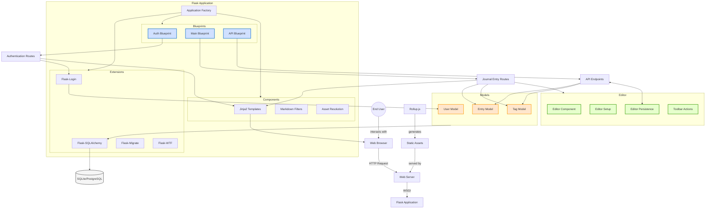

# Architecture Overview

## Introduction

This document provides a high-level overview of the Flask Journal application architecture, detailing the major components, their responsibilities, and how they interact with each other. Understanding this architecture is essential for developers working on extending or maintaining the application.

## System Architecture Diagram

The following diagram illustrates the high-level architecture of the Flask Journal application:

*Figure 1: High-level architecture diagram of the Flask Journal application showing key components and their interactions.*

## Key Components

### 1. Application Factory

The application factory (`create_app()` in `journal/__init__.py`) is responsible for:

- Creating and configuring the Flask application instance
- Initializing extensions
- Registering blueprints
- Setting up logging
- Configuring asset management
- Providing global template context

This approach allows for easier testing and multiple instance creation.

### 2. Blueprints

The application is modularized using Flask blueprints:

| Blueprint | Purpose | Location |
|-----------|---------|----------|
| Auth Blueprint | User authentication | `journal/auth/` |
| Main Blueprint | Core journal functionality | `journal/main/` |
| API Blueprint | REST API endpoints | `journal/api/` |

Each blueprint encapsulates a specific area of functionality, with its own routes, templates, and forms.

### 3. Database Models

The application uses SQLAlchemy ORM models to represent database entities:

| Model | Purpose | Location |
|-------|---------|----------|
| User | User authentication information | `journal/models/user.py` |
| Entry | Journal entries created by users | `journal/models/entry.py` |
| Tag | Tags for categorizing entries | `journal/models/tag.py` |

These models define the database schema, relationships, and business logic for their respective entities.

### 4. Extensions

The application leverages several Flask extensions:

| Extension | Purpose |
|-----------|---------|
| Flask-SQLAlchemy | ORM for database access |
| Flask-Login | User session management |
| Flask-Migrate | Database migration support |
| Flask-WTF | Form handling and CSRF protection |

### 5. Frontend Components

The frontend is built with:

| Component | Purpose |
|-----------|---------|
| Jinja2 Templates | HTML rendering with template inheritance |
| Rollup.js | JavaScript module bundling |
| Alpine.js | Declarative JavaScript framework |
| Markdown | Content formatting |
| CodeMirror | Rich text editor |

### 6. Asset Pipeline

Static assets are managed through:

- Rollup.js for JavaScript bundling and tree-shaking
- Content hashing for cache busting
- Manifest file for mapping logical names to hashed file paths

## Data Flow

### 1. Request Handling Flow

1. User interacts with the browser interface
2. Browser sends HTTP request to the web server
3. Request is passed to the Flask application via WSGI
4. Flask routes the request to the appropriate blueprint
5. Blueprint handler executes and interacts with models as needed
6. Handler renders templates or returns JSON responses
7. Response is returned to the browser

### 2. Authentication Flow

1. User submits login credentials
2. Auth blueprint validates credentials
3. Flask-Login creates user session
4. Subsequent requests include session cookie
5. Protected routes check authentication status
6. User can log out to end the session

### 3. Data Persistence Flow

1. Models define the structure and relationships of data
2. Form submissions create or update model instances
3. SQLAlchemy ORM translates Python objects to SQL
4. Database stores or retrieves the data
5. Flask-Migrate handles schema changes

## Deployment Architecture

The application can be deployed in various configurations:

### Development Environment

- Flask's built-in development server
- SQLite database
- Debug mode enabled
- Auto-reloading on file changes

### Production Environment

- Gunicorn WSGI server
- Reverse proxy (Nginx/Apache)
- PostgreSQL database
- Systemd service for process management

## Extension Points

The architecture is designed with several extension points:

1. **New Blueprints**: Additional functionality can be added as new blueprints
2. **Model Extensions**: The data model can be extended with new entities
3. **Template Customization**: Jinja2 templates can be overridden
4. **API Endpoints**: The API can be extended with new endpoints
5. **Middleware**: WSGI middleware can be added for cross-cutting concerns

## Technology Stack

| Layer | Technologies |
|-------|--------------|
| Frontend | HTML, CSS, JavaScript, Alpine.js, CodeMirror |
| Backend | Python, Flask, Jinja2 |
| Database | SQLAlchemy ORM, SQLite (dev), PostgreSQL (prod) |
| Build Tools | Rollup.js, npm |
| Deployment | Gunicorn, Systemd, Nginx |
| Testing | Pytest, pytest-cov |

## Conclusion

The Flask Journal application follows a modular, blueprint-based architecture that provides a clear separation of concerns. The application factory pattern enables flexibility in configuration and testing, while the use of established extensions ensures reliable handling of common web application needs.

Understanding this architecture provides the foundation for effectively working with the codebase, whether for maintenance, troubleshooting, or extending functionality.

## See Also

- [Authentication Guide](authentication.md)
- [Data Model Guide](data-model.md)
- [API Reference](api-reference.md)
- [Diagramming Approach](diagramming-approach.md)