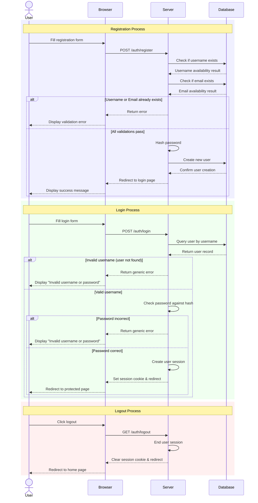

***

title: "Authentication System Guide"
description: "Comprehensive documentation of the Flask Journal authentication system"
category: "Guides"
date\_created: "2025-04-08"
last\_updated: "2025-04-08"
version: "1.0"
status: active
related\_topics:
\- "API Reference"
\- "Data Model"
\- "User Management"
tags: \["authentication", "security", "flask-login", "user"]
------------------------------------------------------------

# Authentication System Guide

## Overview

This document provides a comprehensive explanation of the authentication system used in the Flask Journal application. It covers user registration, login, session management, and the protection of routes requiring authentication.

The Flask Journal application uses Flask-Login for authentication, which provides user session management and the tools needed to restrict access to certain views to authenticated users only.

## Core Components

### User Model

The authentication system is built around the `User` model, which implements the interface required by Flask-Login:

- `is_authenticated`: A property that returns `True` for users with valid credentials
- `is_active`: A property that returns `True` for active users
- `is_anonymous`: A property that returns `False` for authenticated users
- `get_id()`: A method that returns a unique identifier for the user as a string

The `User` model also includes methods for password handling:

- `set_password(password)`: Hashes a password and stores it
- `check_password(password)`: Verifies a password against the stored hash

### Session Management

Flask-Login handles the session management, using secure cookies to remember the user's login state between requests. The session is configured in the application's `__init__.py` file, where the `LoginManager` is initialized.

The application uses Flask's session cookie for authentication, which includes:

- Secure storage of the user's ID
- Optional "remember me" functionality for persistent sessions
- Protection against cookie tampering using cryptographic signatures

## Authentication Flow

The following sequence diagram illustrates the key authentication processes in the Flask Journal application:



*Figure 1: Sequence diagram showing registration, login, and logout processes.*

### Registration Process

1. User navigates to `/auth/register`
2. A registration form is displayed with fields for:

- Username
- Email
- Password
- Password confirmation

3. Upon form submission, the server:

- Validates all inputs
- Checks for duplicate usernames and emails
- Hashes the password using Werkzeug's `generate_password_hash` function
- Creates a new User record
- Redirects to the login page with a success message

**Route Details:**

```python
@auth.route('/register', methods=['GET', 'POST'])
def register():
    # Implementation details in journal/auth/routes.py
```

**Security Considerations:**

- Passwords are never stored in plain text
- Werkzeug's password hashing uses a strong algorithm (scrypt in recent versions)
- Duplicate username/email checks prevent account conflicts

### Login Process

1. User navigates to `/auth/login`
2. A login form is displayed with fields for:

- Username
- Password
- "Remember me" checkbox

3. Upon form submission, the server:

- Retrieves the user by username
- Checks the password against the stored hash
- If valid, creates a session for the user using `login_user()`
- If "remember me" was checked, sets a long-term session
- Redirects to the next page or the index page

**Route Details:**

```python
@auth.route('/login', methods=['GET', 'POST'])
def login():
    # Implementation details in journal/auth/routes.py
```

**Security Considerations:**

- Failed login attempts provide generic error messages to prevent username enumeration
- The "next" parameter is validated to prevent open redirects
- Password checking uses constant-time comparison to prevent timing attacks

### Logout Process

1. User navigates to `/auth/logout`
2. The server:

- Terminates the user's session using `logout_user()`
- Displays a confirmation message
- Redirects to the index page

**Route Details:**

```python
@auth.route('/logout')
@login_required
def logout():
    # Implementation details in journal/auth/routes.py
```

**Security Considerations:**

- The logout route is protected by `login_required` to prevent confusion
- Session data is properly cleared to prevent session fixation attacks

## Protected Routes

The application uses the `@login_required` decorator to protect routes that should only be accessible to authenticated users. When an unauthenticated user attempts to access a protected route:

1. The request is intercepted by Flask-Login
2. The user is redirected to the login page
3. The original URL is stored in the `next` parameter
4. After login, the user is redirected back to the originally requested URL

**Example:**

```python
@main.route('/')
@login_required
def index():
    # This route is protected
    # Only authenticated users can access it
```

### Checking Current User

Throughout the application, `current_user` (provided by Flask-Login) can be used to access the currently logged-in user. This object is available in all routes and templates.

**Example of ownership verification:**

```python
@main.route('/entry/<int:entry_id>')
@login_required
def entry_detail(entry_id):
    entry = db.get_or_404(Entry, entry_id)
    if entry.author != current_user:
        abort(403)  # Forbidden access if not the owner
    # Continue with the request
```

## Password Security

### Password Hashing

The Flask Journal application uses Werkzeug's password hashing functions, which:

1. Generate a random salt for each password
2. Apply a cryptographically strong hashing algorithm (scrypt in recent versions)
3. Store the algorithm, salt, and hash together

**Implementation:**

```python
def set_password(self, password):
    """Hashes the password and stores it."""
    self.password_hash = generate_password_hash(password)

def check_password(self, password):
    """Checks if the provided password matches the stored hash."""
    return check_password_hash(self.password_hash, password)
```

### Password Requirements

Currently, the application implements basic password validation through Flask-WTF form validation. Future enhancements may include more robust password policies.

## CSRF Protection

The Flask Journal application uses Flask-WTF's CSRF protection for all forms to prevent Cross-Site Request Forgery attacks.

**Implementation:**

- CSRF protection is enabled globally in the application configuration
- All forms created using Flask-WTF automatically include a CSRF token
- POST requests are verified to ensure they contain a valid CSRF token

## Authentication Extension Points

### Potential Future Enhancements

The following enhancements are not currently implemented but may be added in future versions:

- Password reset functionality
- Email verification
- Two-factor authentication
- OAuth integration for social login
- API token-based authentication (JWT)

## Troubleshooting

### Common Authentication Issues

**Issue: "Invalid username or password" error**

- Ensure you're using the correct username (not email) to log in
- Verify that caps lock is not enabled
- If you've forgotten your password, you'll need to create a new account (password reset is not implemented yet)

**Issue: Logged out unexpectedly**

- Session cookies may have expired (default session lifetime is browser session)
- Check if "Remember me" was checked during login for persistent sessions
- Server restarts may invalidate sessions if session storage is not persistent

## See Also

- [API Reference](api-reference.md)
- [Data Model Documentation](data-model.md)
- [Flask-Login Documentation](https://flask-login.readthedocs.io/)
