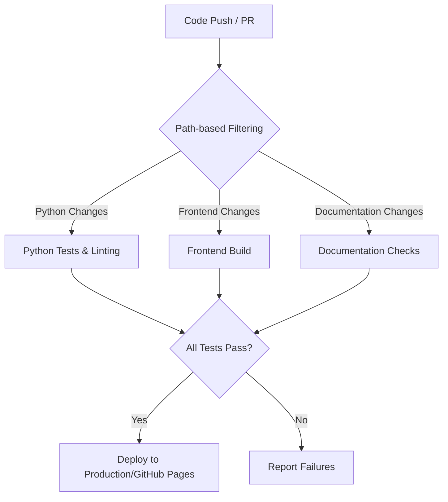

***

title: "CI/CD Workflow Guide"
description: "Comprehensive guide to the Journal project's CI/CD workflow and GitHub configuration"
category: "Development Guides"
related\_topics:
\- "Documentation Review Process"
\- "Documentation Testing Process"
\- "Markdown Linting Guide"
version: "1.0"
status: "active"
tags: \["ci-cd", "workflow", "github", "automation", "documentation"]
---------------------------------------------------------------------

# CI/CD Workflow Guide

This guide documents the Continuous Integration and Continuous Deployment (CI/CD) workflow for the Journal project. It provides an overview of all workflows, GitHub configurations, and best practices.

## 1. Overview

Our CI/CD pipeline automates testing, building, and deployment tasks to maintain high code quality and streamline the development process. The workflows are triggered based on specific events like pull requests or pushes to the main branch.



## 2. GitHub Workflows

All workflow configurations are stored in the `.github/workflows/` directory.

### 2.1. Documentation Checks (`documentation-checks.yml`)

This workflow enforces documentation quality by running markdown linting and link checking on documentation files.

**Triggering Conditions:**

- Pull requests targeting the `main` branch
- Only runs when files in the `docs/` directory, the workflow file itself, or package files are modified

**Jobs:**

- **Lint Markdown & Check Links**: Runs both `npm run lint:md` and `npm run lint:links` to ensure documentation meets quality standards

### 2.2. Python Tests (`python-tests.yml`)

This workflow runs tests and linting for the Python codebase.

**Triggering Conditions:**

- Push to `main` branch
- Pull requests targeting the `main` branch
- Only runs when Python files, requirements, or the workflow itself is modified

**Jobs:**

- **Run Tests & Linting**: Sets up Python, installs dependencies, runs flake8 for linting, and executes pytest with coverage reporting

### 2.3. Frontend Build (`frontend-build.yml`)

This workflow validates and builds the frontend assets.

**Triggering Conditions:**

- Push to `main` branch
- Pull requests targeting the `main` branch
- Only runs when frontend source files, build configuration, or the workflow itself is modified

**Jobs:**

- **Build Frontend Assets**: Sets up Node.js, installs dependencies, and builds the frontend assets using Rollup

### 2.4. Deploy Documentation (`deploy-docs.yml`)

This workflow builds and deploys the project documentation to GitHub Pages.

**Triggering Conditions:**

- Push to `main` branch that modifies documentation or the workflow itself
- Manual trigger via the Actions tab (workflow\_dispatch)

**Jobs:**

- **Build**: Prepares the documentation by generating JSDoc documentation and organizing the docs structure
- **Deploy**: Deploys the documentation to GitHub Pages

## 3. GitHub Repository Templates

### 3.1. Issue Templates

We use standardized issue templates to ensure consistent reporting. These are located in `.github/ISSUE_TEMPLATE/`:

- **Bug Report (`bug_report.md`)**: For reporting bugs with detailed reproduction steps
- **Feature Request (`feature_request.md`)**: For suggesting new features
- **Documentation Update (`documentation.md`)**: For suggesting improvements to documentation

### 3.2. Pull Request Template

The PR template (`.github/PULL_REQUEST_TEMPLATE.md`) guides contributors on providing necessary information when submitting changes.

## 4. Documentation Hosting & GitHub Pages Configuration

The *source* documentation files reside in the `/docs` directory on the `main` branch. However, the live documentation site is *built* by the `deploy-docs.yml` workflow and hosted on **GitHub Pages**.

**Workflow Process:**

1. The workflow checks out the code.
2. It generates JSDoc API documentation (`npm run docs`).
3. It prepares a build directory (`_site`) containing source docs and generated API docs.
4. This build directory is uploaded as a GitHub Pages artifact.
5. The `deploy` job deploys this artifact to GitHub Pages.

**GitHub Pages Setup:**
To enable this:

1. Go to your repository on GitHub.
2. Navigate to Settings > Pages.
3. Under "Build and deployment", ensure "Source" is set to **"GitHub Actions"**.
4. The site will be available at `https://<username>.github.io/<repository>/` (e.g., `https://verlyn13.github.io/journal/`).

## 5. Best Practices

### 5.1. Branch Protection Rules

To maintain code quality, configure branch protection rules for the `main` branch:

1. Go to Settings > Branches > Add rule
2. Set "Branch name pattern" to `main`
3. Enable:

- Require pull request reviews before merging
- Require status checks to pass before merging
- Require branches to be up to date before merging

### 5.4. Using the GitHub CLI (`gh`)

Many CI/CD tasks, such as triggering workflows, viewing run logs, or managing releases, can be performed using the [GitHub CLI Developer Guide](gh-cli.md). Familiarizing yourself with `gh` can significantly streamline your development workflow.
4\. Add the CI workflow status checks as required

### 5.2. Conventional Commits

Follow the [Conventional Commits](https://www.conventionalcommits.org/) specification for commit messages:

```
<type>[optional scope]: <description>

[optional body]

[optional footer(s)]
```

Types:

- `feat`: New feature
- `fix`: Bug fix
- `docs`: Documentation changes
- `style`: Code style changes (formatting, etc.)
- `refactor`: Code changes that neither fixes bugs nor adds features
- `perf`: Performance improvements
- `test`: Adding or correcting tests
- `chore`: Changes to the build process or auxiliary tools

### 5.3. Workflow File Maintenance

When modifying workflow files:

1. Add the workflow file itself to the `paths` section to ensure changes to the workflow trigger the workflow
2. Use path-based filtering to optimize CI runtime
3. Cache dependencies where possible
4. Use specific versions for actions (e.g., `v4` instead of `latest`)

## 6. Manual Setup Instructions

If you need to set up these workflows manually in a new repository:

1. Create the `.github/workflows/` directory
2. Create each workflow file with the provided configurations
3. Set up GitHub Pages in the repository settings
4. Configure branch protection rules
5. Create the issue and PR templates

## 7. Troubleshooting

### 7.1. Common Issues

- **Workflow didn't trigger**: Check the `paths` filter in the workflow file
- **Documentation deployment failed**: Verify GitHub Pages permissions and settings
- **Broken links detected**: Run `npm run lint:links` locally to identify and fix broken links
- **Tests failing in CI but passing locally**: Check for environment-specific dependencies or issues

### 7.2. GitHub Actions Log Debugging

Use the GitHub Actions tab in your repository to access detailed logs for debugging CI/CD issues.
