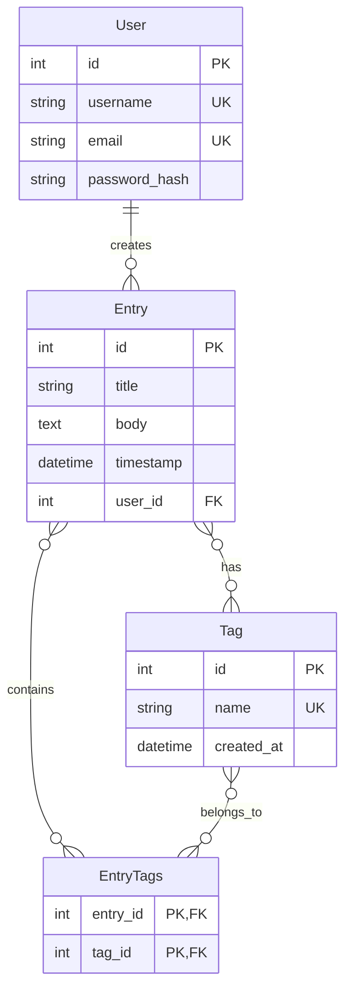

# Data Model Guide

## Overview

This document provides a comprehensive explanation of the data model used in the Flask Journal application. It covers the database tables, relationships, and fields that make up the application's data structure.

The Flask Journal application uses SQLAlchemy as its Object-Relational Mapping (ORM) system, allowing Python classes to represent database tables and instances of those classes to represent rows in the tables.

## Data Model Diagram

The following entity-relationship diagram illustrates the database schema and relationships between models:



*Figure 1: Entity-Relationship diagram showing the Flask Journal data model with tables, fields, and relationships.*

## Core Models

### User Model

The `User` model represents registered users of the application and serves as the foundation for authentication and authorization.

**Table Name:** `users`

**Fields:**

| Field | Type | Constraints | Description |
|-------|------|------------|-------------|
| `id` | Integer | Primary Key | Unique identifier for the user |
| `username` | String(64) | Unique, Indexed, Not Null | User's login name |
| `email` | String(120) | Unique, Indexed, Not Null | User's email address |
| `password_hash` | String(256) | | Securely hashed password |

**Relationships:**

| Relationship | Type | Target Model | Description |
|--------------|------|-------------|-------------|
| `entries` | One-to-Many | `Entry` | Journal entries created by this user |

**Special Methods:**

- `set_password(password)`: Hashes a password using Werkzeug's `generate_password_hash` function
- `check_password(password)`: Verifies a password against the stored hash
- `__repr__()`: Returns a string representation of the user

**Usage Example:**

```python
# Creating a new user
user = User(username='johndoe', email='john@example.com')
user.set_password('secure_password')
db.session.add(user)
db.session.commit()

# Authenticating a user
user = User.query.filter_by(username='johndoe').first()
if user is not None and user.check_password('secure_password'):
    print("Authentication successful")
```

**Implementation:**

```python
class User(UserMixin, db.Model):
    __tablename__ = 'users'
    
    id = db.Column(db.Integer, primary_key=True)
    username = db.Column(db.String(64), index=True, unique=True, nullable=False)
    email = db.Column(db.String(120), index=True, unique=True, nullable=False)
    password_hash = db.Column(db.String(256))
    entries = db.relationship('Entry', backref='author', lazy='dynamic', 
                              cascade="all, delete-orphan")
    
    def set_password(self, password):
        self.password_hash = generate_password_hash(password)
    
    def check_password(self, password):
        return check_password_hash(self.password_hash, password)
    
    def __repr__(self):
        return f'<User {self.username}>'
```

### Entry Model

The `Entry` model represents journal entries created by users.

**Table Name:** `entry`

**Fields:**

| Field | Type | Constraints | Description |
|-------|------|------------|-------------|
| `id` | Integer | Primary Key | Unique identifier for the entry |
| `title` | String(140) | Not Null | Title of the journal entry |
| `body` | Text | Not Null | Main content of the journal entry |
| `timestamp` | DateTime | Indexed | When the entry was created, default to UTC now |
| `user_id` | Integer | Foreign Key, Not Null | References the user who created this entry |

**Relationships:**

| Relationship | Type | Target Model | Description |
|--------------|------|-------------|-------------|
| `author` | Many-to-One | `User` | User who created this entry (backref from User.entries) |
| `tags` | Many-to-Many | `Tag` | Tags associated with this entry |

**Usage Example:**

```python
# Creating a new entry
entry = Entry(title="My First Entry", 
              body="This is the content of my first journal entry.",
              author=current_user)
db.session.add(entry)
db.session.commit()

# Retrieving entries for a user
user_entries = Entry.query.filter_by(author=current_user)\
                          .order_by(Entry.timestamp.desc()).all()
```

**Implementation:**

```python
class Entry(db.Model):
    id = db.Column(db.Integer, primary_key=True)
    title = db.Column(db.String(140), nullable=False)
    body = db.Column(db.Text, nullable=False)
    timestamp = db.Column(db.DateTime, index=True, default=datetime.utcnow)
    user_id = db.Column(db.Integer, db.ForeignKey('users.id'), nullable=False)
    
    tags = db.relationship('Tag', secondary=entry_tags, lazy='subquery',
                           backref=db.backref('entries', lazy=True))
    
    def __repr__(self):
        return f'<Entry {self.title}>'
```

### Tag Model

The `Tag` model represents tags that can be applied to journal entries, allowing for categorization and filtering.

**Table Name:** `tag`

**Fields:**

| Field | Type | Constraints | Description |
|-------|------|------------|-------------|
| `id` | Integer | Primary Key | Unique identifier for the tag |
| `name` | String(50) | Unique, Not Null | Name of the tag |
| `created_at` | DateTime | | When the tag was created, default to UTC now |

**Relationships:**

| Relationship | Type | Target Model | Description |
|--------------|------|-------------|-------------|
| `entries` | Many-to-Many | `Entry` | Entries associated with this tag (backref from Entry.tags) |

**Usage Example:**

```python
# Creating a new tag
tag = Tag(name="personal")
db.session.add(tag)
db.session.commit()

# Adding a tag to an entry
entry.tags.append(tag)
db.session.commit()

# Finding entries with a specific tag
tag = Tag.query.filter_by(name="personal").first()
tagged_entries = tag.entries
```

**Implementation:**

```python
class Tag(db.Model):
    id = db.Column(db.Integer, primary_key=True)
    name = db.Column(db.String(50), unique=True, nullable=False)
    created_at = db.Column(db.DateTime, default=datetime.utcnow)
    
    def __repr__(self):
        return f'<Tag {self.name}>'
```

## Association Tables

### Entry-Tag Association

This table manages the many-to-many relationship between entries and tags.

**Table Name:** `entry_tags`

**Fields:**

| Field | Type | Constraints | Description |
|-------|------|------------|-------------|
| `entry_id` | Integer | Primary Key, Foreign Key | References an entry |
| `tag_id` | Integer | Primary Key, Foreign Key | References a tag |

**Implementation:**

```python
entry_tags = db.Table('entry_tags',
    db.Column('entry_id', db.Integer, db.ForeignKey('entry.id'), primary_key=True),
    db.Column('tag_id', db.Integer, db.ForeignKey('tag.id'), primary_key=True)
)
```

## Relationships and Navigation

### One-to-Many Relationships

**User to Entries:**
- A User can have many Entries
- Each Entry belongs to exactly one User
- Navigation: `user.entries` or `entry.author`

### Many-to-Many Relationships

**Entries to Tags:**
- An Entry can have many Tags
- A Tag can be applied to many Entries
- Navigation: `entry.tags` or `tag.entries`

## Database Operations

### Common Query Patterns

**Retrieving a User's Entries (newest first):**
```python
entries = Entry.query.filter_by(author=current_user)\
                    .order_by(Entry.timestamp.desc())\
                    .paginate(page=page, per_page=per_page)
```

**Finding Entries with a Specific Tag:**
```python
entries = Entry.query.join(Entry.tags)\
                    .filter(Tag.id == tag.id)\
                    .filter(Entry.user_id == current_user.id)\
                    .order_by(Entry.timestamp.desc())
```

**Processing Tags from a Comma-Separated String:**
```python
def process_tags(tag_string):
    if not tag_string:
        return []
    
    # Normalize tag names
    raw_names = [name.strip().lower() for name in tag_string.split(',') if name.strip()]
    unique_names = sorted(list(set(raw_names)))
    
    # Get existing tags or create new ones
    tags = []
    existing_tags = Tag.query.filter(Tag.name.in_(unique_names)).all()
    existing_names = {tag.name for tag in existing_tags}
    tags.extend(existing_tags)
    
    # Create new tags as needed
    for name in unique_names:
        if name not in existing_names:
            new_tag = Tag(name=name)
            db.session.add(new_tag)
            tags.append(new_tag)
    
    return tags
```

## Data Integrity

### Cascade Behavior

- When a User is deleted, all their Entries are deleted (`cascade="all, delete-orphan"`)
- When an Entry is deleted, its associations with Tags are removed, but the Tags themselves remain
- Tags without entries can be identified but are not automatically removed

### Constraints

- Usernames and emails must be unique
- Tag names must be unique
- Entries must have a title and body
- All entries must be associated with a valid user

## Timestamps and Timezone Handling

The application stores timestamps in UTC (naive datetime objects) using `datetime.utcnow` as the default value. When displaying timestamps to users, the application should convert them to the user's local timezone.

## Database Schema Evolution

As the application evolves, you may need to modify the database schema. Flask-Migrate (based on Alembic) is used for managing database migrations.

**Creating a Migration:**
```bash
flask db migrate -m "Description of changes"
```

**Applying Migrations:**
```bash
flask db upgrade
```

## See Also

- [API Reference](api-reference.md)
- [Authentication Guide](authentication.md)
- [SQLAlchemy Documentation](https://docs.sqlalchemy.org/en/14/)
- [Flask-SQLAlchemy Documentation](https://flask-sqlalchemy.palletsprojects.com/)