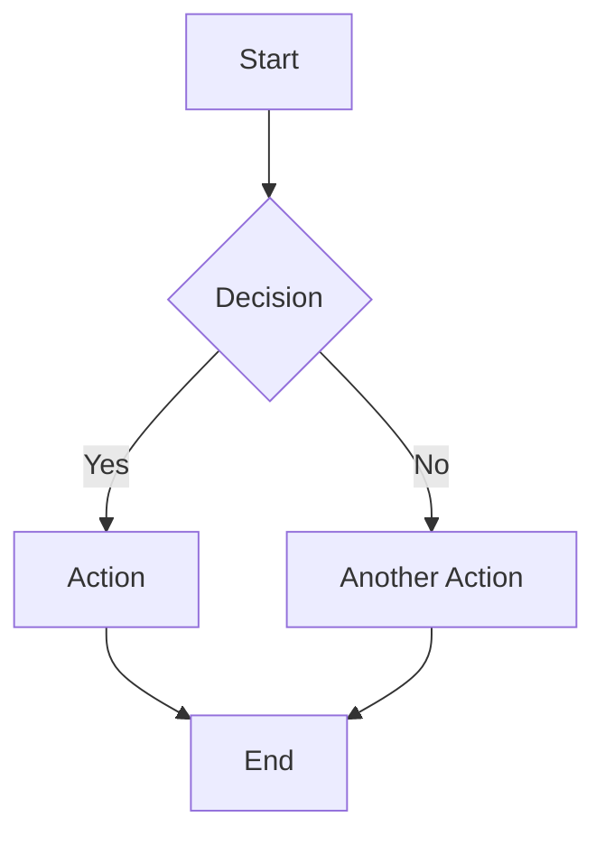
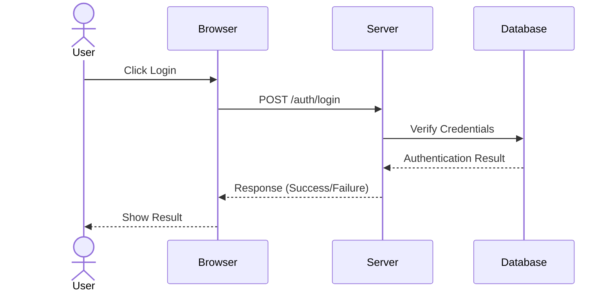
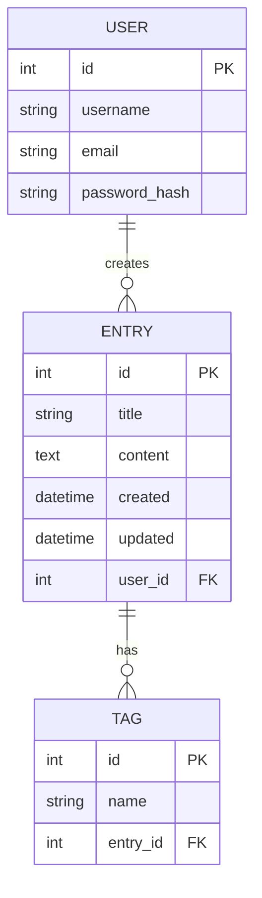

# Diagramming Approach for Flask Journal

## Overview

This guide documents the chosen approach for creating, maintaining, and integrating visual diagrams in the Flask Journal project documentation. Visual documentation is essential for conveying complex architectural concepts, workflows, and relationships that would be difficult to express with text alone.

## Diagramming Solution: Mermaid

After evaluating various diagramming options, **Mermaid** has been selected as the primary diagramming tool for Flask Journal documentation.

### Why Mermaid?

1. **Native Markdown Integration**: Mermaid diagrams can be embedded directly in Markdown documents using code blocks
2. **Version Control Friendly**: Diagrams are defined as text, making them easy to track in Git
3. **Wide Rendering Support**: Supported by GitHub, GitLab, and many Markdown viewers
4. **No External Dependencies**: No need for external image files or proprietary tools
5. **Extensive Diagram Types**: Supports flowcharts, sequence diagrams, class diagrams, ER diagrams, etc.
6. **Active Community & Development**: Well-maintained with regular updates

### Implementation Details

Mermaid diagrams are embedded in Markdown using the following syntax:

````markdown

````

When rendered in compatible Markdown viewers, this will display as a rendered diagram.

## Diagram Types and Use Cases

The following diagram types will be used in Flask Journal documentation:

| Diagram Type | Mermaid Syntax | Use Cases |
|--------------|----------------|-----------|
| Flowchart | `graph TD` or `graph LR` | Process flows, decision trees, algorithms |
| Sequence Diagram | `sequenceDiagram` | Request handling, authentication flows, API interactions |
| Class Diagram | `classDiagram` | Model relationships, class inheritance |
| Entity Relationship | `erDiagram` | Database schema, data model visualization |
| State Diagram | `stateDiagram-v2` | User session states, entry editing states |
| Gantt Chart | `gantt` | Project timeline, development phases |

## Key Areas for Visual Documentation

Based on analysis of the project and documentation needs, the following key areas have been identified for visual documentation:

### 1. System Architecture

**Purpose**: Illustrate the high-level components of the Flask Journal application and how they interact.

**Diagram Type**: Flowchart (TD - Top Down)

**Target Document**: `docs/guides/architecture-overview.md` (to be created)

**Key Elements to Include**:
- Flask application structure (blueprints)
- Database interactions
- Authentication system
- Frontend components
- Asset pipeline (Rollup)

### 2. Request Lifecycle

**Purpose**: Visualize the journey of a typical request through the application.

**Diagram Type**: Sequence Diagram

**Target Document**: `docs/guides/request-lifecycle.md` (to be created)

**Key Elements to Include**:
- Flask routing
- Blueprint handling
- Authentication middleware
- Database queries
- Template rendering
- Response generation

### 3. Authentication Flow

**Purpose**: Document the authentication process for user login and registration.

**Diagram Type**: Sequence Diagram

**Target Document**: `docs/guides/authentication.md` (existing)

**Key Elements to Include**:
- Login sequence
- Registration sequence
- Password hashing
- Session management
- Logout process

### 4. Data Model Relationships

**Purpose**: Visualize the database schema and relationships between models.

**Diagram Type**: Entity Relationship Diagram

**Target Document**: `docs/guides/data-model.md` (existing)

**Key Elements to Include**:
- User model
- Entry model
- Tag model
- Relationships and cardinality
- Key fields and types

### 5. Editor Component Interaction

**Purpose**: Illustrate how the various components of the editor interact.

**Diagram Type**: Flowchart and Sequence Diagram

**Target Document**: `docs/guides/editor-architecture.md` (to be created)

**Key Elements to Include**:
- Editor components
- Event flow
- Data persistence
- Markdown preview
- Toolbar actions

## Maintenance Guidelines

To ensure diagrams remain accurate and useful over time:

1. **Review During Changes**: Update relevant diagrams when architectural changes are made
2. **Keep Diagrams Focused**: Each diagram should illustrate one clear concept
3. **Use Consistent Styling**: Maintain consistent colors, shapes, and naming conventions
4. **Include Captions**: Always add descriptive captions that explain the diagram's purpose
5. **Version Diagrams**: Note diagram version or last-updated date in comments

## Mermaid Reference

### Basic Flowchart


### Sequence Diagram



### Entity Relationship Diagram



## Tools for Working with Mermaid

- [Mermaid Live Editor](https://mermaid.live/): Online editor for creating and previewing diagrams
- [Mermaid CLI](https://github.com/mermaid-js/mermaid-cli): Command-line tool for rendering diagrams
- [VS Code Mermaid Extension](https://marketplace.visualstudio.com/items?itemName=bierner.markdown-mermaid): Preview Mermaid diagrams directly in VS Code

## See Also

- [Official Mermaid Documentation](https://mermaid-js.github.io/mermaid/)
- [JSDoc Standards Guide](jsdoc-standards.md)
- [Python Docstring Standards Guide](python-docstring-standards.md)
- [Documentation Templates Guide](documentation-templates.md)