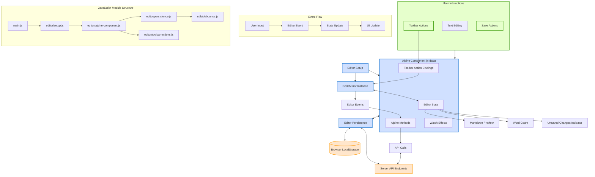

# Editor Architecture

## Overview

The Flask Journal editor is a rich text editing component that allows users to create and edit journal entries using Markdown. It features real-time preview, toolbar actions for common formatting, and persistent drafts. This document explains the architecture of the editor component, its interactions, and its integration with the rest of the application.

## Editor Component Diagram

The following diagram illustrates the architecture and interactions of the editor component:



*Figure 1: Diagram showing the editor architecture, component interactions, and data flow.*

## Key Components

### 1. Editor Setup

The Editor Setup component (`editor/setup.js`) is responsible for:

- Initializing the CodeMirror editor instance
- Configuring editor options (theme, keybindings, etc.)
- Registering event handlers
- Initializing the Alpine.js component
- Connecting the editor to the persistence module

This component serves as the entry point for the editor and orchestrates the other components.

### 2. Alpine.js Component

The Alpine.js component (`editor/alpine-component.js`) provides the reactive data model and methods for the editor. It includes:

- Editor state (content, dirty state, word count, etc.)
- Methods for manipulating editor content
- Bindings for toolbar actions
- Integration with editor persistence
- Event handlers for user interactions

This component uses Alpine.js's reactivity system to maintain state and update the UI in response to changes. It includes robust initialization logic to handle potential DOM timing issues when attaching the CodeMirror editor.

### 3. Editor Persistence

The Editor Persistence component (`editor/persistence.js`) handles saving and loading editor content:

- Autosaves drafts to localStorage
- Communicates with server API endpoints for saving
- Handles versioning and conflict resolution
- Manages the dirty state (unsaved changes)
- Implements debounced save operations

This component ensures users don't lose their work and provides a seamless editing experience.

### 4. Toolbar Actions

The Toolbar Actions component (`editor/toolbar-actions.js`) provides:

- Functions for common Markdown formatting operations
- Button click handlers for the toolbar
- Cursor position management for insertions
- Keyboard shortcut integration

Each toolbar action manipulates the editor content in a specific way, abstracting the complexity of working directly with CodeMirror.

### 5. CodeMirror Integration

The CodeMirror library provides the core editing functionality:

- Text editing with syntax highlighting
- Cursor and selection management
- Undo/redo capabilities
- Keyboard shortcuts
- Events for content changes

The Flask Journal application uses a configured instance of CodeMirror that matches the application's needs.

## Event Flow and Data Binding

### Editor Events

The editor components interact through a series of events:

1. **User Interaction**: User types in the editor or clicks toolbar buttons
2. **CodeMirror Events**: CodeMirror emits change events
3. **State Updates**: Alpine component updates its state
4. **UI Updates**: DOM elements respond to state changes
5. **Persistence**: Changes are automatically saved after debouncing

This reactive flow ensures that all components stay in sync and that the UI properly reflects the current state.

### Data Flow

Data flows through the editor components as follows:

1. **Input**: User input enters through CodeMirror or toolbar buttons
2. **Processing**: Input is processed by the appropriate handler
3. **State Update**: Editor state is updated in the Alpine component
4. **Persistence**: Changes are saved to localStorage and/or server
5. **Output**: UI is updated to reflect changes (preview, word count, etc.)

## API Integration

The editor interacts with the server through several API endpoints:

| Endpoint | Method | Purpose |
|----------|--------|---------|
| `/api/entries/<id>` | GET | Load an existing entry |
| `/api/entries/<id>` | PUT | Update an existing entry |
| `/api/entries` | POST | Create a new entry |
| `/api/entries/draft` | GET | Retrieve saved draft |
| `/api/entries/draft` | POST | Save draft |
| `/api/v1/markdown` | POST | Generate HTML preview (server-side) |

These endpoints allow the editor to save and load content, storing drafts and published entries.

## Configuration and Customization

The editor can be configured through:

1. **Initial Setup**: Options passed to the `setupEditor` function
2. **User Preferences**: Settings stored in localStorage
3. **Server Configuration**: Settings passed from the server

Common configurable options include:

- Editor theme (light/dark)
- Font size and family
- Line numbers visibility
- Autosave interval
- Markdown dialect

## File Structure

The editor code is organized into several JavaScript modules:

```
src/js/
├── main.js                  # Main entry point
├── editor/
│   ├── setup.js             # Editor initialization
│   ├── alpine-component.js  # Alpine.js x-data definition
│   ├── persistence.js       # Save/load functionality
│   ├── toolbar-actions.js   # Toolbar button handlers
│   └── keybindings.js       # Keyboard shortcut definitions
└── utils/
    ├── debounce.js          # Utility for debouncing functions
    └── markdown.js          # Markdown processing utilities
```

These files are bundled using Rollup.js into a single JavaScript file that is loaded by the application.

## Initialization Process

The editor initialization follows these steps:

1. DOM is loaded and `main.js` executes
2. `setupEditor` is called with the target element and options
3. CodeMirror instance is created and configured
4. Alpine component (`editor/alpine-component.js`) is attached to the editor container (`x-data`).
5. Inside the Alpine component's `init()` method, `$nextTick` is used to ensure the component's DOM is rendered.
6. Within `$nextTick`, the target DOM element for CodeMirror (`[x-ref="editorElement"]`) is located using a direct query (`this.$el.querySelector`) to avoid potential timing issues with Alpine's `$refs`.
7. The CodeMirror instance is created by `createEditor` (`editor/setup.js`) and attached to the found target element.
8. The Persistence module (`editor/persistence.js`) is initialized.
9. Event listeners (e.g., for auto-save, content changes) are registered.
10. Initial content is loaded (from the embedded script tag or localStorage draft).
11. Editor is ready for user interaction.

## Error Handling

The editor implements several error handling strategies:

1. **Network Errors**: Failed API calls trigger retry mechanisms and user notifications
2. **Data Loss Prevention**: Content is saved to localStorage as a backup
3. **Conflict Resolution**: Version checking prevents overwriting newer content
4. **Graceful Degradation**: Core editing still works if advanced features fail

## Performance Considerations

To maintain good performance, the editor:

1. **Debounces Input**: Prevents excessive processing during rapid typing
2. **Lazy Loads Components**: Non-essential features load after core functionality
3. **Optimizes DOM Updates**: Uses Alpine.js reactivity to minimize DOM operations
4. **Manages Editor Size**: Limits the preview recalculation for large documents

## Conclusion

The editor architecture provides a rich, reliable editing experience through a modular, reactive design. The separation of concerns between components allows for easier maintenance and extension. The integration with the server API and local storage ensures data persistence and synchronization.

Understanding this architecture is essential for maintaining and extending the editor functionality as the Flask Journal application evolves.

## See Also

- [Architecture Overview](architecture-overview.md)
- [JavaScript API Documentation](../js-api/index.html)
- [API Reference](api-reference.md)
- [Diagramming Approach](diagramming-approach.md)