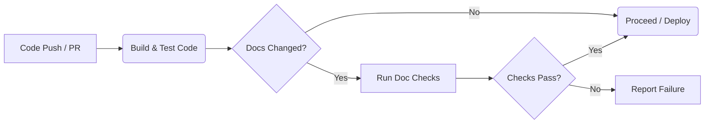

# Proposal: CI/CD Integration for Documentation Checks

## 1. Introduction

To maintain high-quality, consistent, and reliable documentation, this proposal outlines the integration of automated documentation checks into the project's Continuous Integration/Continuous Deployment (CI/CD) pipeline. Automating these checks ensures that documentation standards are consistently enforced and reduces the manual burden on reviewers.

This proposal focuses on two key checks:
-   **Markdown Linting:** Enforces style and formatting rules for `.md` files.
-   **Link Checking:** Verifies that internal and external links within `.md` files are valid.

## 2. Checks to Implement

The following checks should be implemented, using the scripts defined in `package.json`:

### 2.1. Markdown Linting

-   **Purpose:** Ensure consistency in Markdown formatting and style according to project standards (implicitly using `markdownlint-cli` defaults or a future configuration file).
-   **Command:** `npm run lint:md`
-   *(Underlying command: `npx markdownlint "docs/**/*.md"`)*
-   **Scope:** All `.md` files within the `docs/` directory and its subdirectories.

### 2.2. Link Checking

-   **Purpose:** Detect broken internal or external links within the documentation.
-   **Command:** `npm run lint:links`
-   *(Underlying command: `npx markdown-link-check "docs/**/*.md"`)*
-   **Scope:** All `.md` files within the `docs/` directory and its subdirectories.
-   **Note:** This check makes external network requests and might be slower or require specific network configuration in the CI environment. Configuration (e.g., retry logic, timeouts, ignoring specific links) might be necessary via a `.mlc_config.json` file in the future if needed.

## 3. Proposed CI/CD Integration Strategy

### 3.1. Triggering Conditions

It is recommended to run these checks automatically on **Pull Requests (PRs)** targeting the main development branch (e.g., `main` or `develop`).

-   **Efficiency:** To optimize pipeline execution time, consider running these checks *only* when files within the `docs/` directory have been modified in the PR. Most CI systems allow path-based filtering for job execution.

### 3.2. Pipeline Placement

These checks should run as a separate job or stage within the CI pipeline, ideally after code linting/testing stages but before any deployment steps.

*Figure 1: Conceptual placement of documentation checks in CI pipeline.*

### 3.3. Failure Handling

-   **Recommendation:** Documentation check failures should **report errors** clearly in the CI/CD logs and the Pull Request interface.
-   **Strictness (Optional):** Consider configuring the CI job to **fail** (preventing merge) if either `lint:md` or `lint:links` fails. This enforces documentation quality strictly but requires diligence from developers to fix issues before merging. A phased approach could start with reporting only and move to blocking merges later.
-   **Link Check Flakiness:** Be mindful that external link checking (`lint:links`) can sometimes fail due to temporary network issues or server downtime unrelated to the documentation itself. If blocking merges, ensure appropriate retry logic or a mechanism to temporarily bypass the check for known flaky links is considered.

## 4. Implementation Notes

-   The actual implementation of these CI/CD jobs depends on the specific platform used (e.g., GitHub Actions, GitLab CI, Jenkins).
-   The CI environment will need Node.js and npm installed to execute the commands.
-   Coordination with the team responsible for managing the CI/CD pipeline is required for implementation.

## 5. Conclusion

Integrating automated Markdown linting and link checking into the CI/CD pipeline will significantly improve documentation quality and consistency with minimal ongoing effort. It shifts error detection earlier in the development process and reinforces the importance of documentation as part of the core product.